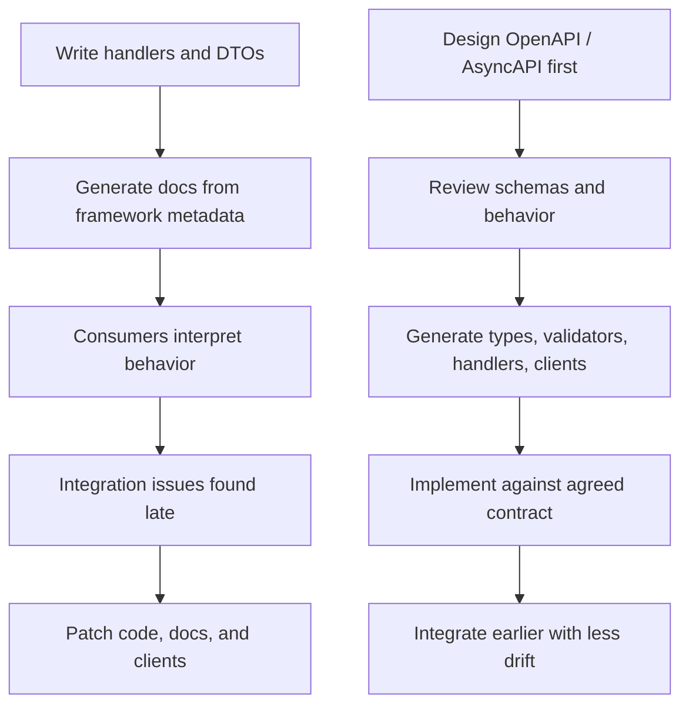
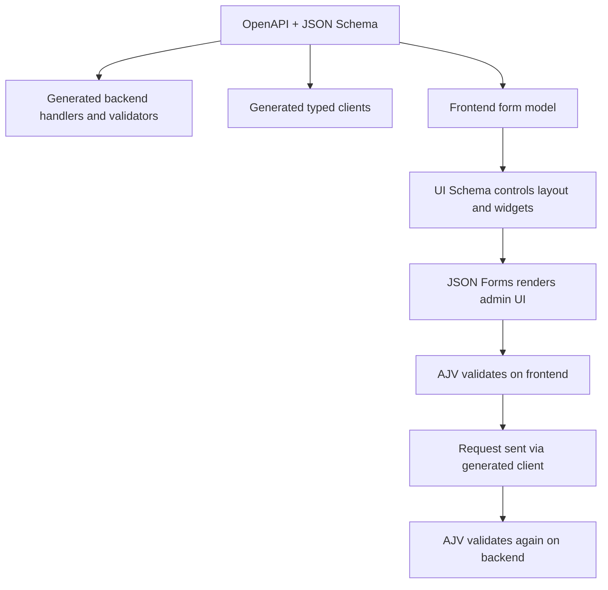
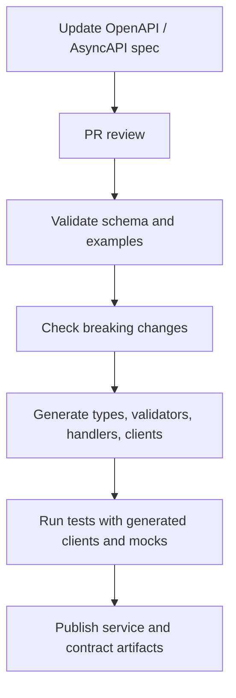

## Contract should come before the code

Most teams still treat the API contract as a byproduct.

First they write handlers. Then they add DTOs. Then they wire validation. Then they try to expose documentation from the running application. Then frontend, QA, and other services start integrating. Then the mismatches appear: nullable fields interpreted differently, undocumented edge cases, duplicated validation rules, inconsistent enums, ad hoc error formats, and fragile client code scattered across repositories.

At small scale, this is survivable. At platform scale, it becomes delivery drag.

Spec-first development solves this by moving the center of gravity. Instead of allowing the implementation to define the interface implicitly, the interface is defined explicitly first and everything else is built from it.

That sounds procedural. In practice, it is architectural.

Because once the contract becomes a first-class source artifact, design stops being something hidden inside controller code and starts becoming something reviewable, automatable, and reusable.

For modern distributed systems, that is a significant shift.

## The contract is not documentation

This is the first mindset change that matters.

An OpenAPI document is not just something you publish to Swagger UI so people can browse endpoints. An AsyncAPI document is not just a catalog of topics and message payloads. JSON Schema is not just a validation format.

Taken together, they describe the boundary of a system in a form that both humans and tooling can understand.

That boundary includes far more than field names and primitive types. It includes:

- allowed payload shapes
- required and optional fields
- format and structural constraints
- error contracts
- auth requirements
- role and scope expectations
- compatibility expectations
- event payload definitions
- shared model semantics across backend and frontend

Once you define that boundary up front, you gain leverage that code-first teams usually leave on the table.

You stop rediscovering your system from implementation details. You start designing it intentionally.

## What code-first usually looks like in real systems

Code-first approaches are attractive because they feel fast.

Write the endpoint. Decorate it. Generate documentation from the framework metadata. Maybe infer schemas from DTOs or TypeScript types. It looks efficient because the code is the source of truth and the docs appear almost automatically.

That convenience is real, but it has limits.

In simple services, it can work well enough. In larger systems, especially where multiple teams and repositories are involved, it starts to break down:

- documentation quality depends on implementation details and framework conventions
- the design is reviewed only after it already exists in code
- the generated contract often reflects transport structure but not design intent
- frontend and backend model drift appears over time
- schema reuse becomes inconsistent across services
- validation logic gets duplicated in too many layers
- client libraries are often weak, missing runtime guards or clear typing

The result is a system that technically runs, but is harder to evolve safely.

The problem is not that code-first is always wrong. The problem is that it tends to make implementation the place where design decisions happen by accident.

Spec-first forces those decisions into the open while they are still cheap.

## Why JSON Schema is more powerful than most teams realize

A lot of teams already use JSON Schema indirectly without treating it as a strategic asset.

They see it inside OpenAPI. They use it through validation tooling. Maybe they rely on it for some form generation or configuration validation. But they still think of it primarily as plumbing.

That misses the point.

JSON Schema is one of the most effective boundary-definition tools available for modern backend platforms. It gives you a machine-readable model of data structures and constraints that can travel across the system:

- API specifications
- runtime validation
- generated types
- frontend forms
- mocks
- test fixtures
- contract diffing
- shared platform libraries

That is where the real value is.

Not in having one more schema language, but in having one common representation that different parts of the delivery chain can rely on consistently.

When teams say they want a “single source of truth,” this is one of the few places where that phrase can actually mean something concrete.

## Spec-first at platform level

The biggest advantage of spec-first usually appears when you stop looking at it as a per-service preference and start treating it as a platform capability.

That was our experience while building the backend platform for Fizz.

The model is straightforward:

- the OpenAPI document is hosted as a static YAML file in the service source code
- handlers, types, and validators are generated from the contract
- AJV is used for validation on both backend and frontend
- CI ensures HTTP clients are generated and kept in sync
- the generated clients can be used by backend consumers, frontend applications, and tests
- tests can execute against mocks without hardcoding request details such as URLs, methods, or payload assumptions

That changes developer experience in a very practical way.

Instead of every consumer manually reconstructing how to call a service, the contract drives client generation. Instead of backend validation logic diverging from frontend assumptions, both sides validate against the same schema vocabulary. Instead of tests becoming brittle because request details are duplicated, generated clients become the stable integration surface.

The feedback from developers was clear: DX improved because the system stopped requiring people to memorize interface trivia.

That may sound like a small improvement. It is not. Interface trivia is exactly the kind of repeated cognitive overhead that slows teams down quietly.

## Static OpenAPI as a source artifact, not an exported artifact

One subtle but important implementation detail is where the contract lives.

In many code-first setups, the API document is something generated by a running application. That creates a dependency chain where the contract is derived from code and often only exists reliably after compilation or bootstrapping.

A static OpenAPI YAML checked into the service source code flips that relationship.

The specification exists before the service runs. It can be reviewed in pull requests. It can be linted and validated independently. It can participate in code generation, breaking-change checks, documentation publishing, and test tooling before the implementation is even complete.

That makes the contract a development input, not a runtime byproduct.

And once you make that shift, architecture becomes much easier to govern.

## Visual: implementation-first vs spec-first

## Generated clients are not just convenience code

Generated clients are often framed as a productivity feature. That is true, but incomplete.

The more important benefit is that they encode correctness.

Without generated clients, consumers tend to manually replicate the interface:

- paths and query parameters are assembled by hand
- HTTP methods are repeated from memory
- auth headers are wired inconsistently
- request and response typing is partial
- error handling differs between consumers
- tests hardcode endpoint details
- topic names or payload structures drift in evented systems

Every one of those repetitions creates a chance for divergence.

When a CI pipeline ensures the clients are generated from the current contract, you substantially reduce that category of error. Consumers stop depending on memory and conventions. They depend on artifacts derived directly from the contract.

In our case, that also improved testing. Generated clients can be used in end-to-mock tests, which means tests are written against the same contract-driven surface that production consumers use. No duplicated URLs, no hand-rolled fetch wrappers, no magic strings for methods or route shapes.

That is a major quality gain because it removes an entire class of test brittleness.

## Runtime validation matters as much as static typing

One recurring mistake in TypeScript-heavy systems is assuming that compile-time types are enough.

They are not.

TypeScript helps developers reason about expected shapes during development. It does not validate external input at runtime. It does not protect you from malformed payloads coming from other services, older clients, partially rolled-out consumers, or third-party integrations.

That is where JSON Schema plus AJV becomes important.

If your handlers, clients, and forms are all rooted in the same schema family, runtime validation becomes consistent across system boundaries.

This matters on the backend, where you need to validate inbound requests and sometimes outbound contracts. It matters on the frontend too, where you need to validate user input and ensure the payload you are about to send still conforms to the API contract.

Using AJV on both sides helps close the gap between static intent and runtime reality.

A good type system tells you what should happen.  
A good validator tells you what actually happened.

You want both.

## Frontend benefits are often underestimated

Spec-first discussions often stay backend-centric. That is a mistake, because some of the highest leverage shows up in frontend and admin tooling.

Once your APIs are described with JSON Schema-backed contracts and the same schemas are accessible to frontend applications, you can start doing much more than generating clients.

You can use libraries like **JSON Forms** to simplify admin interface development significantly.

That does not mean “generate the whole frontend from schema” and call it a day. That approach is usually too simplistic for customer-facing UX. But for internal tooling, admin backoffices, operations screens, configuration editors, and workflow forms, schema-driven UI can be an enormous accelerator.

The pattern is especially effective when you separate concerns cleanly:

- **JSON Schema** describes the data contract and validation semantics
- **UI Schema** describes layout and presentation concerns
- **AJV** validates form data against the same schema model used by the API contract

This creates a strong end-to-end alignment:

1. The backend contract defines what valid payloads look like.
2. The frontend form can be generated or strongly assisted from the same schema family.
3. The UI schema can control rendering, grouping, widgets, and layout.
4. The submitted form payload can be validated before sending.
5. The backend validates the same structure again on receipt.

That is a much cleaner model than manually reimplementing field definitions, validation rules, and structural assumptions separately in every layer.

For admin surfaces, this can dramatically reduce the amount of repetitive UI code while improving consistency.

## JSON Forms and schema-driven admin surfaces

This is where things become particularly interesting from a platform-engineering perspective.

Internal platforms often suffer from a long tail of operational forms and admin interfaces:

- product attribute editors
- pricing configuration
- integration setup screens
- rules and policy editors
- merchant onboarding forms
- support tools
- feature configuration panels

These interfaces are usually important but not always differentiating. They need to be correct, maintainable, and fast to evolve more than they need bespoke handcrafted UX on every field.

A schema-driven approach works well here.

With JSON Forms or similar tooling, you can define the shape and validation in JSON Schema, use UI schema for presentation and component selection, and still preserve strict compatibility with the backend contract.

That gives you a number of concrete advantages:

- much less duplicated field modeling
- consistent validation messages and rules
- easier generation of new admin surfaces
- lower maintenance cost when schemas evolve
- better confidence that submitted data matches the API contract
- easier onboarding for developers building internal tools

The important part is not blind code generation. The important part is controlled reuse of the contract model.

When done well, this feels less like “generated UI” and more like “a platform that removes avoidable repetition.”

## Visual: schema-driven flow from API to admin UI

## Async systems benefit even more from explicit contracts

Spec-first becomes even more important when the system is not purely synchronous.

HTTP at least makes interfaces visible. Endpoints have paths, methods, and status codes. Messaging systems are often much less self-describing once they start growing. Topics multiply. Message payloads evolve informally. Similar events appear with slightly different semantics. Consumers rely on undocumented assumptions.

This is where AsyncAPI and disciplined schema reuse matter.

In event-driven systems, ambiguity is more dangerous because failures are often delayed and distributed. A malformed assumption may not fail loudly. It may quietly corrupt downstream behavior or break an integration in ways that are expensive to trace.

Explicit event contracts help define:

- message payloads
- ownership boundaries
- versioning approach
- correlation identifiers
- compatibility expectations
- examples and semantic intent

The same principle applies as with HTTP APIs: if the contract exists as a first-class artifact, it can participate in validation, review, generation, and governance.

Without that, event-driven architectures tend to accumulate invisible coupling.

## Security and authorization become easier to standardize

Spec-first also improves how teams think about security.

In too many systems, authorization logic is added after the interface shape is already decided. Endpoints get protected in code, roles are implied rather than modeled, and policy expectations are distributed across framework annotations, middleware, and service-specific conventions.

A contract-first approach gives you a better place to make those concerns visible.

When scopes, auth schemes, and protected operations are represented in the contract, several things get easier:

- reviewers can inspect security intent earlier
- generated artifacts can understand auth requirements consistently
- consumer teams know what credentials or scopes are needed
- gaps become more visible during design review instead of after rollout

It does not eliminate the need for sound authorization architecture, but it moves security-relevant information closer to the interface where it belongs.

For platform teams, that matters a lot.

## Parallel development becomes realistic, not aspirational

One of the biggest organizational advantages of spec-first is that it makes parallel work less risky.

Once the contract is stable enough:

- backend can implement handlers
- frontend can consume generated clients
- QA can derive test scenarios and fixtures
- mocks can be produced from the spec
- integration tests can start earlier
- consumer services can develop against the contract without waiting for a fully deployed provider

This reduces coordination bottlenecks that otherwise become normal in service-oriented delivery.

Instead of sequencing teams around uncertainty, you give them a shared artifact that narrows uncertainty enough for concurrent work.

That is one of the main reasons spec-first scales so well in product organizations with multiple teams.

## CI is where the approach becomes enforceable

A contract written first is useful. A contract enforced by CI is transformative.

Once CI ensures that the specification is valid and generated artifacts stay current, the workflow becomes much harder to bypass accidentally.

Typical checks in a mature setup include:

- OpenAPI or AsyncAPI validation
- schema linting
- breaking-change detection
- generation of handlers, types, validators, and clients
- verification that generated code is committed or published correctly
- test execution against generated clients and mocks

This is the difference between “we prefer contract-first” and “our platform is contract-driven.”

The latter is much stronger because it does not rely on memory or discipline alone.

## Visual: spec-first platform workflow

## Where spec-first can go wrong

Spec-first is not magic.

If the schemas are weak, the generated artifacts are poor, or the team treats the spec as bureaucratic overhead, the process can become heavy without creating enough value.

It usually fails when:

- specs are written but not authoritative
- validation exists only on one side of the boundary
- examples are missing
- generated code quality is too low
- versioning and compatibility rules are unclear
- teams model trivial details too aggressively
- nobody owns the contract lifecycle

The answer is not to abandon the approach. It is to be selective and disciplined.

Use it where contracts matter. Make the spec authoritative. Keep schemas readable. Generate the artifacts that create real leverage. Enforce the workflow in CI. Treat contract reviews as design reviews.

That is where the returns compound.

## Why this matters more as systems mature

At early stage, almost any interface approach can feel acceptable because the number of consumers is small and the feedback loop is tight.

As systems mature, the cost profile changes.

Now you have:

- more services
- more frontend surfaces
- more teams
- more environments
- more backward compatibility pressure
- more governance requirements
- more operational tooling
- more need for reliable automation

At that point, interfaces stop being a local implementation detail. They become part of the platform itself.

That is exactly where spec-first starts to outperform code-first decisively.

Because the real value is not just that the contract is documented. It is that the contract becomes executable across the entire delivery pipeline.

## The takeaway

Spec-first is not about producing prettier API docs.

It is about making contracts explicit early enough that your tooling, tests, validators, clients, and teams can all rely on the same source model.

That is why JSON Schema deserves more attention than it usually gets. It is not just validation plumbing. It is the connective tissue that can link API design, runtime safety, client generation, admin UI generation, and platform governance into one coherent workflow.

In our case, that has been especially clear on the Fizz backend platform:

- static OpenAPI in service source code
- generated handlers, types, and validators
- AJV on backend and frontend
- CI-enforced client generation
- generated clients used across services, frontend, and tests
- schema-driven admin UI acceleration with tools like JSON Forms

The result is not just better documentation. It is better developer experience, less duplicated work, fewer integration surprises, and a platform that is easier to evolve safely.

If your team already uses OpenAPI, AsyncAPI, or JSON Schema, you are probably closer to this model than you think.

The real question is whether your contracts merely describe the system after the fact, or whether they actively shape how the system is built.

That distinction is where the leverage is.