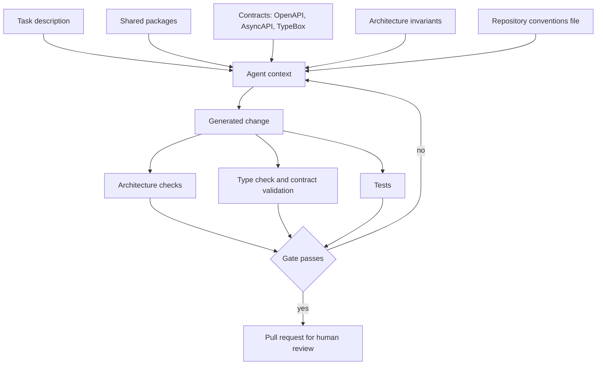
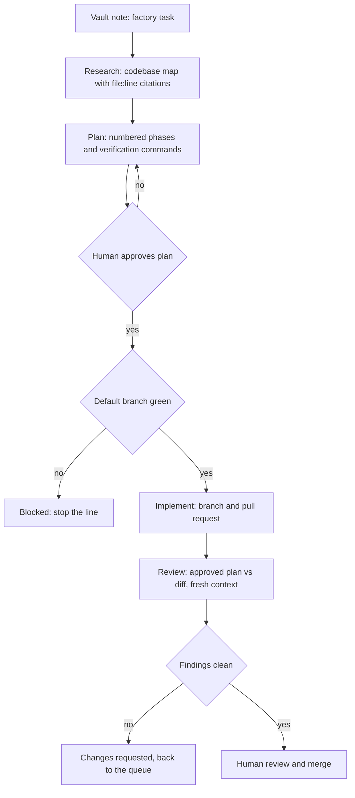

## The blank page is the problem, not the typing

Ask a capable model to add a feature to an empty repository and you will probably get something that runs. You will also get a new configuration pattern, error shape, logging convention, money representation, and repository layer. Each choice may be defensible on its own. Taken together, they form a system nobody designed.

Give the same task to the same model in a codebase with a shared config package, one route kit, one money type, one error union, and architecture rules enforced in CI. Now it has far fewer decisions to invent and can compose the pieces already there.

This part of AI-assisted development gets little attention because it is old and unglamorous. The quality of your building blocks has always limited how fast a team can move safely. AI pushed much more code at that limit, so weak foundations show up sooner and more often.

## The four kinds of building block

"Building blocks" often gets read as "libraries." An AI-native workflow depends on four broader categories:

1. **Runtime blocks:** shared packages that do work at runtime. Config, HTTP, auth, money, IDs, monitoring. Code you do not write again.
2. **Contract blocks:** OpenAPI, AsyncAPI, JSON Schema, TypeBox definitions. The shape of the boundary, defined before the implementation exists.
3. **Guideline blocks:** architecture invariants, layering rules, naming and ownership conventions. What is allowed, what is forbidden, and why.
4. **Process blocks:** the gates. Review, approval, CI checks, budgets, branch protection. Where a change has to prove itself before it moves.

A human engineer absorbs the last two by osmosis over months. An agent has none of that history; it gets one context window and whatever you put in it. The useful measure, then, is how much of your system's design intent can be consumed and checked by something with no institutional memory. Model choice matters far less.

If the answer is "it is in people's heads and in the code, mostly," you will get output that looks right and drifts.

## Constraints are what make generated output good

In production systems, more freedom and a better prompt rarely produce the most dependable result. Useful constraints do.

A model produces the most probable code for the context it was given. With a blank context, "most probable" means the average of everything on the internet, which is a mix of tutorials, blog snippets, and abandoned repositories. With a constrained context, "most probable" means the pattern your codebase already uses fifty times.

The context shifts the model toward your codebase instead of the internet average.

Every one of these narrows the space in a useful way:

- a shared package that already solves the concern
- a schema that defines what a valid payload looks like
- a layering rule that forbids the shortcut
- a test that fails when the shortcut is taken
- a scaffold that produces the right skeleton before generation starts

This is ordinary platform engineering, applied where it has the most effect: before generation starts.

## Context is scarce, and a good package is compression

Building blocks also save context, which is finite and expensive.

Every token spent on a model rediscovering how your system does authentication is a token not spent on the actual problem. Every file the agent has to read to infer a convention is latency, cost, and an opportunity to infer it slightly wrong.

A well-designed package is compression. `@monad-systems/config` in the context means the agent does not need to read six environment-loading implementations to guess the house style. One import line replaces a research phase.

The same logic applies to contracts. A TypeBox route schema states the interface in a form that is shorter than the implementation, unambiguous, and machine-checkable. It is a better prompt than any prompt, because it is also the test.

For larger organisations, this changes the economics. The report *Platform engineering 2.0: An evolution for the AI era* (Weave Intelligence, commissioned by Broadcom, 2026) puts numbers on the pressure: developers generating two to ten times more code, and token spend arriving as a new and largely invisible cost category that most organisations have no tooling to track. At that scale compression stops being a matter of taste and starts showing up in the bill.

## Our building blocks: the `@monad-systems` packages

Our package catalogue grew out of an ERP platform monorepo where the same code kept appearing twice. It was not designed as a framework.

What got extracted, and is now published to GitHub Packages under the `@monad-systems` scope, is deliberately unglamorous:

- **`config`** — typed environment configuration with a declarative field spec, aggregated errors, cross-field rules, and production hardening
- **`http-kit`** — a spec-first route kit that binds a typed handler to its TypeBox route schema with end-to-end inference
- **`contract-schemas`** — shared contract primitives reused across module contracts
- **`monitoring`** — OpenTelemetry-backed monitoring utilities
- **`auth-keycloak`** — OIDC clients and a scope-based ability builder
- **`audit-hash`** — canonical audit-log hash chaining, one implementation shared by every writer and the verifier
- **`snowflake-id`** — string-safe Snowflake ID generation
- **`ts-config`, `eslint-config`, `prettier-config`** — the shared toolchain baseline

Alongside them, in-repo and deliberately not published, sit the platform packages (kernel, adapters, testing, workflow), the domain value objects such as money and invoice math, generated API and event clients, and the tooling: architecture checks, code generation, a migration runner, and a module scaffold.

The split matters more than the list. Generic blocks can travel between systems; product policy should stay in the repository that owns it. Publish too much and the result becomes a framework nobody can change. Publish nothing and the same audit-hash function gets written four times, with one subtly different version.

The rule we apply is narrow: extract when it is generic, single-concern, and already has real consumers in the repository. Not before.

## Guidelines only count when they execute

Most enterprise codebases we see have plenty of standards, but many exist only as prose. A wiki page can say "domain code must not import the database layer"; a CI check can prevent the import from shipping.

That difference always mattered. With agents in the loop it becomes decisive, because an agent will happily satisfy every documented convention it was shown and violate the one that was only implied. It has no instinct telling it that this particular shortcut is the one that caused the incident last year.

So we write the invariants down, and then we make them run. In our ERP platform there are twenty-two of them, covering things like:

- a module exposes only what its `package.json#exports` lists, and deep imports across modules fail CI
- a module owns exactly one database schema, and cross-schema joins and foreign keys are forbidden
- every write goes through a use case that owns the transaction
- every event publish goes through the outbox, never a direct broker call from domain code
- `Date.now()` and `new Date()` are forbidden outside infrastructure; inject a clock
- monetary values use the money package, and `number` is forbidden for monetary fields
- TypeBox schemas are the source of truth, generated contracts are read-only in CI
- generated code is never hand-edited

Each of these has an enforcement mechanism: an architecture check, a lint rule, a type boundary, or a test. The full policy suite runs as one command, and CI runs it on every pull request. Human or agent, the same gate applies.

The enforcement turns a style guide into a path an autonomous worker can follow. If the change cannot merge without satisfying the rule, it matters less whether the agent remembered the prose.

## Visual: what an agent needs, and where it comes from

## The software factory: a vault, an orchestrator, and a boundary

Hermes is the software-factory orchestrator that consumes these blocks: tasks go in; agent runs, pull requests, and notes come out.

The entry point is deliberately boring. Tasks are notes in an Obsidian vault, with frontmatter marking them as factory tasks. A watcher picks them up and advances their status as the work progresses. The vault is where the intent lives, which means the task, its budget, its result, and its review verdict all end up in the same place a human already keeps their thinking.

From there, each task moves through four steps, each one a fresh context that inherits only the previous step's compacted artifact:

1. **Research:** check out the target repository, read the files the model selects, produce a codebase map with a `file:line` citation for every claim.
2. **Plan:** consume the research artifact and produce a numbered-phase plan with files, changes, and a verification command per phase.
3. **Implement:** refuse to run unless a human has approved the plan. Then generate the changes, push a branch, and open a pull request.
4. **Review:** a fresh context sees only the approved plan and the resulting diff. Never the research document, never the reasoning that produced the code. It answers one question: does this diff implement this plan?

The reviewer is deliberately amnesiac. It never sees the chain of reasoning that produced the code, so that reasoning cannot persuade it. It compares intent with artifact, the job a good human reviewer performs and the author of a change usually finds hardest.

And the verdict is derived from the findings, not from the model's own summary. Any unmet plan criterion or any blocking finding means changes requested, regardless of what the reviewer called it. A model that says "looks good overall" while listing three unmet requirements does not get to pass the gate.

Around the steps sit the guardrails that make unattended runs survivable:

- **Human plan approval:** implementation cannot start without it. This is the one gate we have no intention of automating.
- **Stop the line:** implementation refuses to run while the target repository's default branch has failing checks. Research and planning stay allowed, because that is how the breakage gets understood.
- **Budgets:** every run takes the tightest of three ceilings, a per-run runaway limit, the task's own budget, and the project spend cap. A run whose budget is already exhausted fails before its first model call. Every run also has a wall-clock ceiling.
- **A single egress point:** every model call goes through one proxy. No step talks to a provider directly.

## Visual: the run pipeline and its gates

## The PII boundary, or why security has to move down

One component of the factory generates no code at all.

Between Hermes and the model provider sits a PII agent. It is the only process that holds the provider key, and the only process permitted to make an outbound call. Everything else sends placeholders.

Its work is deterministic: recognisers cover Hungarian and English identifiers, tax numbers, social security numbers, national IDs, IBANs and account numbers, cards with checksum validation, phone numbers, email addresses, addresses, and dictionary names. Detected values are tokenised reversibly for each run and stored in a database. Tokens leave the boundary; originals are restored on the response path. Every crossing is written to a hash-chained audit log using the same `audit-hash` package as the rest of the platform.

Detection quality is enforced as a CI gate: a labelled corpus with a recall and precision floor that has to hold before the pipeline ships.

This is a concrete instance of what the platform engineering report calls security shifting down. Shift-left moved security earlier in the timeline and handed developers more tools and more responsibility. Shift-down moves it into the substrate, so it is invisible to the developer and immutable by design.

For AI workloads, an instruction not to leak is weaker than an architecture in which the model never receives the protected data. The instruction depends on compliance. The architecture does not.

The report names the new attack surfaces directly: shadow AI sprawl, prompt injection, model poisoning, and inference data leaks, none of which any SAST or DAST tool detects in a live inference stream. A deterministic tokenisation boundary with an audit trail addresses the last of those at the layer best positioned to contain it.

## The factory is built from the blocks it uses

We did not plan this symmetry, but Hermes is a Fastify service built on `@monad-systems/fastify`, `config`, `http-kit`, `monitoring`, and `snowflake-id`. Its routes are defined spec-first: a TypeBox schema as a `const` before the handler exists, bound with `route(schema, handler)`. Its audit chain uses `audit-hash`. Its admin UI will move onto the shared UI kit when that lands.

The tool that runs agents against our repositories is made of the same parts as the systems those agents work on.

Every improvement to the blocks therefore improves both sides at once, and the factory becomes a first-class consumer of its own standards. When a package is awkward to use, we find out by using it, not by reading a survey.

The cycle closes on itself. Better blocks make agent runs cheaper and more accurate. Cheaper, more accurate runs make it easier to improve the blocks.

## Scale makes the platform more important

This may sound like a tidy setup for a small team. In a large organisation the building-block question matters even more, because every inconsistency gains more consumers.

Drift gets expensive as consumers multiply. Ten teams each solving configuration their own way multiply the surface area for the next migration, the next CVE, and the next compliance requirement by ten.

Agents also arrive as a new class of user. The report is direct about this: AI agents are the first new platform persona in over a decade, and they consume APIs rather than interfaces. They need versioned, well-documented APIs, scoped permissions, non-human identity, audit logging, budget controls, and egress controls. Every one of those is a platform capability rather than a developer preference. If your platform cannot express "this actor may do these things, spending at most this much, and here is the record," you cannot safely run agents at all, however good the model is.

Bounded autonomy turns out to have a shape. Teams operationalising it converge on seven concerns: identity, context, capability, execution, evaluation, security, and observability. Read the factory description above against that list and the mapping is exact. Plan approval and stop-the-line are capability limits. The review step is evaluation. The PII agent is security. Run logs, artifacts, and hash-chained audit are observability. Budgets and spend caps are the execution ceiling. None of it is model-specific, so it survives the next model.

Cost becomes a first-class signal at the same time. The industry baseline is roughly 35% cloud waste before AI infrastructure lands on top of it, and token spend from agentic development is a category most organisations have no tooling for at all. A per-run cost ceiling that kills a run mid-flight is a small thing to build, and it separates an experiment from a budget incident.

Composability is the hedge against pace. The CNCF ecosystem went from roughly 50 projects in 2018 to more than 200 today, and model capabilities and agent patterns turn over faster than that. Nobody is picking the permanently correct tool right now. What you can do is make sure that swapping one does not cascade, which is the same modular, API-first, versioned-contract discipline that made the packages worth extracting in the first place.

Then there is the golden-path problem, where agents change the arithmetic. Standardised templates that once enabled most deployments start blocking the teams doing something new, and every exception routes back through the platform team. When scaffolding, contract generation, and migration work become cheap to run, the platform team can afford more paths instead of defending one. What turns a path into a cage is the cost of extending it.

## Old practices, higher value

Every practice that made software safe to change before AI still does that job. Most are worth more than they were, because the constraint moved.

Contract-first design used to be documentation and a coordination device. It is now the prompt and the gate as well: it tells the agent what to build, and it tells CI whether it built it. Spec-first was a good idea when humans were the only consumers. It is close to mandatory when they are not.

Tests changed role too. An agent can run your suite in a loop, which makes it the fitness function of the generation process rather than a safety net after it. A weak suite now does something worse than miss bugs. It teaches the loop that broken code is acceptable.

Code review is where the bottleneck landed. Verification is the scarce resource once writing is cheap, and what review is for has shifted with it: less typo-hunting, more "does this diff do what we agreed, and only that." Our review step asks that question because it is the one humans should be spending their attention on.

Keeping changes small and single-concern matters more, not less. When generation is cheap, the temptation is to ship large diffs. Resist it. Review is the constraint, and review cost grows faster than diff size.

CI remains the enforcement layer. Agents follow what is enforced, not what is documented. So does everyone else, eventually. Agents just make it obvious immediately.

Observability earns its keep faster now. More code shipping faster means more unknown-unknowns reaching production. Structured logging, tracing, and metrics were always a delivery standard for us, and they are how you find out what an accelerated pipeline actually shipped.

Decision records cover the one thing that cannot be regenerated from source: why. An ADR explaining a trade-off is worth more per line than almost anything else you write, because it is the context that makes the next change correct instead of merely plausible.

Trunk hygiene closes the list. Stop the line is an old manufacturing idea, and it works for the reason it always did: building on a broken foundation multiplies the damage. Automation multiplies it faster.

The mechanism behind all of this is simple. AI changed the cost of producing a candidate solution and left the cost of verifying one roughly where it was. Every practice that improves verification therefore appreciates. Every practice that only improved production speed depreciates.

## Where the engineering effort moves

In our experience, engineers spend less time typing implementations and more time specifying interfaces, defining invariants, building scaffolds, and reviewing intent against outcome. Senior engineering time moves toward system design.

Documentation becomes executable context. A conventions file at the repository root, path-scoped instruction files, task-triggered procedures. Every one of them is read on every run, so they get corrected when they are wrong, so they stay true. Documentation that a machine consumes daily is the first documentation with a working feedback loop.

A new class of non-functional requirement appears as well: egress control, spend caps, non-human identity, action audit, and plan approval. Five years ago none of these appeared on a backlog. They are now prerequisites for running agents against a live codebase, and they belong to the platform team.

## Where this goes wrong

The approach has a maintenance cost and several predictable failure modes:

It fails when:

- packages get extracted before they have consumers, freezing an API around a single use case
- "shared" becomes a dumping ground of pass-through wrappers and vague utility modules
- rules are written as prose and never given an enforcement mechanism
- plan approval degrades into a rubber stamp, which removes the only human gate that matters
- the same system both writes and approves the change
- autonomy is expanded before budgets, audit, and egress control exist
- the block catalogue grows faster than the appetite to maintain it

The fix in each case is the same as it was before agents existed: be selective, keep the blocks few and in use, make the rules executable, and keep a human at the decision points you cannot cheaply undo.

## Build the runway before increasing the speed

Judge AI-assisted development by what the generated code lands on, not by how much code the model can write. Strong packages, explicit contracts, enforced invariants, and reliable gates keep generated changes aligned with the existing system. Standards that live only in people's heads produce plausible drift, usually discovered later in production.

For us that has meant three things in practice: a small catalogue of shared packages published under `@monad-systems` and used by every system we build, twenty-two architecture invariants that run as checks rather than sit in a wiki, and a software factory where task notes become pull requests through a pipeline with human approval, a review gate, spend ceilings, and a deterministic PII boundary as the only route out.

The tools changed. Contract-first design, tests that fail loudly, review against intent, small diffs, enforced CI, observability, and written decisions did not. They now decide whether AI speeds up useful work or merely speeds up drift.
