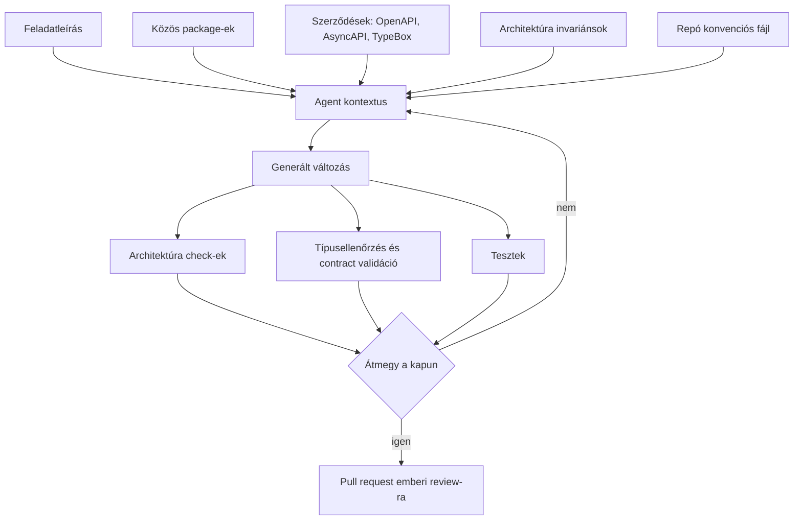
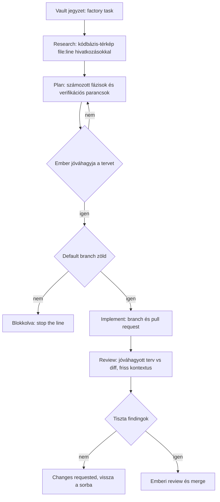

## Nem a gépelés a probléma, hanem az üres lap

Kérj meg egy erős modellt, hogy tegyen egy feature-t egy üres repóba, és valószínűleg kapsz valamit, ami elindul. Kapsz mellé egy új konfigurációs mintát, hibaformátumot, logging konvenciót, pénzábrázolást és repository réteget is. Külön-külön mindegyik döntés védhető lehet. Együtt olyan rendszert alkotnak, amit senki nem tervezett meg.

Add ugyanezt a feladatot ugyanannak a modellnek egy olyan kódbázisban, ahol van közös config package, route kit, money típus, hibaunió és CI-ban kikényszerített architektúra-szabályrendszer. Sokkal kevesebb döntést kell kitalálnia; össze tudja rakni a már meglévő elemeket.

Az AI-támogatott fejlesztésnek ez a része kevés figyelmet kap, mert régi és látványtalan. Az építőelemek minősége mindig is korlátozta, hogy egy csapat milyen gyorsan tud biztonságosan haladni. Az AI sokkal több kódot nyom neki ennek a korlátnak, ezért a gyenge alapok hamarabb és gyakrabban látszanak.

## Az építőelemek négy fajtája

Az „építőelem” alatt gyakran library-t értünk, pedig egy AI-native munkafolyamat négy tágabb kategóriára támaszkodik:

1. **Runtime elemek:** közös package-ek, amelyek futásidőben dolgoznak. Config, HTTP, auth, money, ID-k, monitoring. Kód, amit nem írsz meg újra.
2. **Szerződés elemek:** OpenAPI, AsyncAPI, JSON Schema, TypeBox definíciók. A rendszerhatár alakja, még az implementáció előtt.
3. **Szabály elemek:** architektúra invariánsok, rétegzési szabályok, elnevezési és ownership konvenciók. Mi megengedett, mi tilos, és miért.
4. **Folyamat elemek:** a kapuk. Review, jóváhagyás, CI check-ek, budget, branch protection. Ahol egy változásnak bizonyítania kell, mielőtt továbbmegy.

Egy emberi mérnök az utolsó kettőt hónapok alatt szívja magába. Egy agentnek nincs ilyen története; egy context window-t kap, és azt, amit beleteszel. Ezért az számít, mennyi tervezői szándék érhető el olyan formában, amit egy intézményi memória nélküli szereplő is fel tud dolgozni, és amivel szemben ellenőrizhető. A modellválasztás ehhez képest sokkal kevesebbet nyom.

Ha a válasz az, hogy „nagyrészt a fejekben és a kódban”, akkor olyan outputot kapsz, ami helyesnek látszik és közben elsodródik.

## A korlátok teszik jóvá a generált kódot

Production rendszereknél a több szabadság és a jobb prompt ritkán adja a legmegbízhatóbb eredményt. A hasznos korlátok többet érnek.

A modell a kapott kontextushoz tartozó legvalószínűbb kódot állítja elő. Üres kontextussal a „legvalószínűbb” az internet átlagát jelenti: tutorialokat, blog snippeteket és elhagyott repókat. Szűkített kontextussal a „legvalószínűbb” azt a mintát jelenti, amit a kódbázisod már ötvenszer használ.

A kontextus a saját kódbázisod felé tolja a modellt az internetes átlag helyett.

Mindegyik ezek közül hasznosan szűkíti a teret:

- egy közös package, ami az adott problémát már megoldja
- egy séma, ami definiálja, mi számít érvényes payloadnak
- egy rétegzési szabály, ami tiltja a kerülőutat
- egy teszt, ami elbukik, ha valaki mégis a kerülőutat választja
- egy scaffold, ami a helyes vázat adja, még a generálás előtt

Ez hétköznapi platform engineering, azon a ponton alkalmazva, ahol a legtöbbet számít: még a generálás előtt.

## A kontextus szűkös, a jó package pedig tömörítés

Az építőelemek kontextust is megtakarítanak, a kontextus pedig véges és drága.

Minden token, amit a modell arra költ, hogy újra felfedezze, hogyan működik nálad az authentikáció, olyan token, amit nem a tényleges problémára fordít. Minden fájl, amit el kell olvasnia egy konvenció kikövetkeztetéséhez, latency, költség és egy esély arra, hogy kicsit rosszul következtet.

Egy jól megtervezett package tömörítés. Ha a `@monad-systems/config` ott van a kontextusban, az agentnek nem kell hat környezetváltozó-betöltő implementációt elolvasnia, hogy kitalálja a házi stílust. Egy import sor kivált egy kutatási fázist.

Ugyanez igaz a szerződésekre. Egy TypeBox route séma rövidebben írja le az interfészt, mint az implementáció, egyértelmű, és géppel ellenőrizhető. Jobb prompt minden promptnál, mert egyben teszt is.

Nagyobb szervezeteknél itt válik érdekessé a gazdaságtan. A *Platform engineering 2.0: An evolution for the AI era* riport (Weave Intelligence, Broadcom megbízásából, 2026) számokat is tesz e mellé: a fejlesztők két-tízszer több kódot generálnak, a token spend pedig új és jórészt láthatatlan költségkategóriaként érkezik, amire a legtöbb szervezetnek nincs eszköze. Ilyen léptéknél a tömörítés kilép az ízlés kategóriájából, és megjelenik a számlán.

## A mi építőelemeink: a `@monad-systems` package-ek

A package-katalógusunk egy ERP platform monorepóból nőtt ki, ahol újra és újra ugyanazt a kódot írtuk meg kétszer. Nem frameworknek terveztük.

Ami ebből kiemelésre került, és ma GitHub Packages-en publikált a `@monad-systems` scope alatt, szándékosan látványtalan:

- **`config`** — típusos környezeti konfiguráció deklaratív field spec-kel, aggregált hibákkal, cross-field szabályokkal és production hardeninggel
- **`http-kit`** — spec-first route kit, ami a típusos handlert a TypeBox route sémájához köti, end-to-end inference-szel
- **`contract-schemas`** — közös contract primitívek, amiket a modulszerződések újrahasználnak
- **`monitoring`** — OpenTelemetry alapú monitoring eszközök
- **`auth-keycloak`** — OIDC kliensek és scope alapú ability builder
- **`audit-hash`** — kanonikus audit log hash-lánc, egy implementáció, amit minden író és az ellenőrző is használ
- **`snowflake-id`** — string-biztos Snowflake ID generálás
- **`ts-config`, `eslint-config`, `prettier-config`** — a közös toolchain alap

Mellettük, a repón belül és szándékosan publikálatlanul, ott vannak a platform package-ek (kernel, adapters, testing, workflow), a domain value objectek, mint a money és az invoice math, a generált API és event kliensek, valamint a tooling: architektúra check-ek, kódgenerálás, migration runner és module scaffold.

A szétválasztás fontosabb, mint maga a lista. A generikus elemek utazhatnak a rendszerek között; a terméklogika maradjon az azt birtokló repóban. Ha túl sokat publikálsz, olyan frameworköd lesz, amihez senki nem mer hozzányúlni. Ha semmit, négyszer írod meg az audit-hash függvényt, az egyik verzió pedig finoman eltér a többitől.

A szabály, amit alkalmazunk, szűk: akkor emelünk ki valamit, ha generikus, egy dolgot csinál, és már most van valódi fogyasztója a repóban. Előbb nem.

## A szabály csak akkor szabály, ha fut

A vállalati kódbázisokban, amiket látunk, bőven van standard, de sok közülük csak prózaként létezik. Egy wikioldal leírhatja, hogy „a domain kód nem importálhatja az adatbázis réteget”; egy CI-check meg is akadályozza, hogy ilyen import productionbe kerüljön.

Ez a különbség eddig is számított. Agentekkel a körben viszont döntővé válik, mert egy agent boldogan teljesíti az összes dokumentált konvenciót, amit megmutattak neki, és megsérti azt az egyet, ami csak implicit volt. Nincs benne az az ösztön, ami szólna, hogy pont ez a kerülőút okozta a tavalyi incidenst.

Ezért leírjuk az invariánsokat, aztán futtathatóvá tesszük őket. Az ERP platformunkban huszonkettő van belőlük, többek között ezek:

- egy modul csak azt teszi elérhetővé, ami a `package.json#exports`-ában szerepel, a modulok közötti mély importok CI hibát okoznak
- egy modul pontosan egy adatbázis sémát birtokol, a sémák közötti join és foreign key tilos
- minden írás egy use case-en keresztül megy, ami a tranzakciót birtokolja
- minden event publikálás az outboxon keresztül történik, soha nem közvetlen broker hívással a domain kódból
- a `Date.now()` és a `new Date()` tilos az infrastructure rétegen kívül, injektált clockot használunk
- a pénzértékek a money package-et használják, monetáris mezőnél a `number` tilos
- a TypeBox sémák a forrás, a generált szerződések CI-ban read-only-k
- generált kódot soha nem szerkesztünk kézzel

Mindegyikhez tartozik kikényszerítés: architektúra check, lint szabály, típushatár vagy teszt. A teljes policy suite egy paranccsal fut, és a CI minden pull requestre lefuttatja. Ember vagy agent, ugyanaz a kapu.

A kikényszerítés teszi a style guide-ot egy autonóm szereplő által is követhető úttá. Ha a változás a szabály teljesítése nélkül nem mergelhető, kevésbé számít, hogy az agent megjegyezte-e a prózát.

## Visual: mire van szüksége egy agentnek, és honnan jön

## A software factory: egy vault, egy orchestrator és egy határ

A Hermes az a software factory orchestrator, amely ezeket az elemeket fogyasztja: feladatok mennek be, agent futások, pull requestek és jegyzetek jönnek ki.

A belépési pont szándékosan unalmas. A feladatok jegyzetek egy Obsidian vaultban, frontmatterrel megjelölve. Egy watcher felszedi őket, és a munka haladásával lépteti a státuszukat. A szándék a vaultban él, ami azt jelenti, hogy a feladat, a budgetje, az eredménye és a review verdiktje mind ugyanoda kerül, ahol az ember amúgy is gondolkodik.

Innen minden feladat négy lépésen megy át, mindegyik friss kontextus, ami csak az előző lépés tömörített artifactját örökli:

1. **Research.** Checkout a cél repóból, a modell által kiválasztott fájlok elolvasása, majd egy kódbázis-térkép, ahol minden állítás mellett ott a `file:line` hivatkozás.
2. **Plan.** A research artifact alapján számozott fázisú terv: fájlok, változások, és fázisonként egy verifikációs parancs.
3. **Implement.** Elutasítja a futást, amíg egy ember jóvá nem hagyta a tervet. Utána generál, branchet push-ol, és pull requestet nyit.
4. **Review.** Egy friss kontextus csak a jóváhagyott tervet és a keletkezett diffet látja. A research dokumentumot soha, és azt az érvelést sem, ami a kódot előállította. Egy kérdésre válaszol: ez a diff megvalósítja ezt a tervet?

A reviewer szándékosan amnéziás. Soha nem látja a kódot előállító gondolatmenetet, ezért az nem tudja meggyőzni. A szándékot hasonlítja az eredményhez, vagyis azt a munkát végzi, amit egy jó emberi reviewer is, és amiben a változás szerzője általában a leggyengébb.

A verdikt pedig a findingokból következik, nem a modell saját összefoglalójából. Bármelyik nem teljesült tervkritérium vagy blokkoló finding changes requested-et jelent, függetlenül attól, minek nevezte a reviewer. Az a modell, ami „összességében rendben” minősítést ad, miközben három nem teljesült követelményt sorol fel, nem megy át a kapun.

A lépések körül azok a védőkorlátok állnak, amiktől a felügyelet nélküli futás túlélhető:

- **Emberi terv-jóváhagyás.** Implementáció nélküle nem indul. Ezt az egy kaput nem áll szándékunkban automatizálni.
- **Stop the line.** Az implementáció nem fut, amíg a cél repó default branchén bukó check-ek vannak. A research és a tervezés engedélyezett marad, mert így értjük meg, mi romlott el.
- **Budget.** Minden futás a három plafon közül a legszűkebbet kapja: a futásonkénti elszaladás-limit, a feladat saját budgetje és a projekt spend cap. Az a futás, aminek a budgetje már elfogyott, az első modellhívás előtt elbukik. Mindegyik futásnak van wall-clock plafonja is.
- **Egyetlen egress pont.** Minden modellhívás egy proxyn megy át. Egyik lépés sem beszél közvetlenül a szolgáltatóval.

## Visual: a futási pipeline és a kapui

## A PII határ, avagy miért kell a biztonságnak lefelé mozdulnia

A factory egyik komponense egyáltalán nem generál kódot.

A Hermes és a modellszolgáltató között egy PII agent áll. Ez az egyetlen folyamat, ami a szolgáltatói kulcsot birtokolja, és az egyetlen, ami kifelé hívhat. Minden más placeholdereket küld.

A működése determinisztikus: magyar és angol azonosítókra írt felismerők, adószám, TAJ szám, személyi azonosító, IBAN és bankszámlaszám, kártyaszám ellenőrzőösszeggel, telefonszám, e-mail cím, lakcím és szótáralapú nevek. A talált értékeket futásonként, visszafordíthatóan tokenizálja és adatbázisban tárolja. Kifelé a tokenek mennek; a válasz útján visszaállnak az eredeti értékek. Minden áthaladás hash-láncolt audit logba kerül, ugyanazzal az `audit-hash` package-dzsel, amit a platform többi része is használ.

A felismerés minőségét CI kapu kényszeríti ki: címkézett korpusz, recall és precision küszöbbel, aminek tartania kell, mielőtt a pipeline szállítható.

Ez konkrét megvalósítása annak, amit a platform engineering riport „security shifts down” néven ír le. A shift-left előbbre hozta a biztonságot az időtengelyen, és több eszközt meg több felelősséget adott a fejlesztőnek. A shift-down beleteszi a szubsztrátumba, így a fejlesztő számára láthatatlan és tervezésileg megváltoztathatatlan.

AI workloadoknál a szivárgást tiltó utasítás gyengébb, mint egy olyan architektúra, amelyben a modell soha nem kapja meg a védett adatot. Az utasítás betartása együttműködést feltételez. Az architektúra nem.

A riport néven nevezi az új támadási felületeket is: shadow AI sprawl, prompt injection, model poisoning és inference adatszivárgás, amelyek közül egyet sem talál meg SAST vagy DAST eszköz egy élő inference streamben. Egy determinisztikus, auditált tokenizációs határ az utolsót azon a rétegen kezeli, amelyik erre a legalkalmasabb.

## A factory ugyanazokból az elemekből épül, amiket használ

Ezt a szimmetriát nem terveztük, de a Hermes egy Fastify szolgáltatás, ami a `@monad-systems/fastify`, `config`, `http-kit`, `monitoring` és `snowflake-id` package-ekre épül. Az útvonalai spec-first módon definiáltak: TypeBox séma `const`-ként, mielőtt a handler létezne, majd `route(schema, handler)`. Az audit lánca az `audit-hash`-t használja. Az admin felülete a közös UI kitre költözik, amint az elkészül.

Az az eszköz, ami agenteket futtat a repóinkon, ugyanazokból az alkatrészekből áll, mint azok a rendszerek, amiken az agentek dolgoznak.

Így az építőelemek minden javítása egyszerre javítja mindkét oldalt, a factory pedig a saját standardjainak első számú fogyasztójává válik. Ha egy package kényelmetlen használni, azt használat közben tudjuk meg, nem egy kérdőívből.

A kör önmagára záródik. A jobb építőelemektől olcsóbbak és pontosabbak lesznek az agent futások. Az olcsóbb, pontosabb futásoktól könnyebb javítani az építőelemeket.

## A mérettel együtt nő a platform jelentősége

Mindez elsőre egy kis csapat rendezett setupjának tűnhet. Nagy szervezetben azonban még fontosabb az építőelem-kérdés, mert minden inkonzisztencia több fogyasztót érint.

A sodródás a fogyasztók számával együtt drágul. Tíz csapat, amelyik külön oldja meg a konfigurációt, megtízszerezi a felületet a következő migrációnak, a következő CVE-nek és a következő megfelelőségi követelménynek.

Az agentek emellett új felhasználói osztályként érkeznek. A riport ebben egyértelmű: az AI agentek az első új platform persona több mint egy évtizede, és API-kat fogyasztanak, nem felületeket. Verziózott, dokumentált API-k, scope-olt jogosultságok, nem emberi identitás, audit logging, budget kontroll és egress kontroll kell nekik. Ezek mind platform képességek, nem pedig fejlesztői preferenciák. Ha a platformod nem tudja kifejezni, hogy „ez a szereplő ezeket teheti, legfeljebb ennyiért, és itt a nyoma”, akkor nem tudsz biztonságosan agenteket futtatni, bármilyen jó is a modell.

A bounded autonomy-nak alakja van. Az ezt operacionalizáló csapatok hét témakörre jutnak: identitás, kontextus, képesség, végrehajtás, kiértékelés, biztonság és megfigyelhetőség. Olvasd vissza a fenti factory leírást ezzel a listával, és a megfeleltetés pontos. A terv-jóváhagyás és a stop the line képességkorlát. A review lépés a kiértékelés. A PII agent a biztonság. A futási logok, artifactok és a hash-láncolt audit a megfigyelhetőség. A budget és a spend cap a végrehajtási plafon. Semmi nem modellspecifikus benne, így túléli a következő modellt.

A költség ezzel egyidejűleg első osztályú jellé válik. Az iparági alap nagyjából 35% cloud pazarlás, még mielőtt az AI infrastruktúra rárakódna, az agentic fejlesztésből származó token spend pedig olyan kategória, amire a legtöbb szervezetnek egyáltalán nincs eszköze. Egy futásonkénti költségplafon, ami menet közben megöli a futást, kicsi fejlesztés, és ez a különbség egy kísérlet és egy költségvetési incidens között.

A komponálhatóság a tempó elleni fedezet. A CNCF ökoszisztéma a 2018-as nagyjából 50 projektről mára több mint 200-ra nőtt, a modellképességek és agent minták pedig ennél is gyorsabban cserélődnek. Most senki nem a véglegesen helyes eszközt választja. Amit meg tudsz tenni, az az, hogy a csere ne kaszkádoljon végig a rendszeren, és ez ugyanaz a moduláris, API-first, verziózott szerződéses fegyelem, amitől a package-eket egyáltalán érdemes volt kiemelni.

Ott van aztán a golden path problémája, ahol az agentek átírják a számítást. A standardizált sablonok, amik korábban a deployok többségét kiszolgálták, elkezdik blokkolni azt a csapatot, amelyik valami újat csinál, és minden kivétel visszafut a platform csapathoz. Amikor a scaffolding, a szerződésgenerálás és a migrációs munka olcsóvá válik, a platform csapat több utat engedhet meg magának ahelyett, hogy egyet védene. Egy utat a bővítés költsége tesz ketreccé.

## Régi gyakorlatok, nagyobb érték

Minden gyakorlat, amitől a szoftver az AI előtt biztonságosan változtatható volt, ma is ugyanazt a munkát végzi. A többségük többet ér, mint korábban, mert a szűk keresztmetszet elmozdult.

A szerződés-első tervezés korábban dokumentáció és koordinációs eszköz volt. Ma egyben prompt és kapu is: megmondja az agentnek, mit építsen, és megmondja a CI-nak, hogy azt építette-e. A spec-first jó ötlet volt akkor is, amikor csak emberek fogyasztották. Közel kötelező, amikor már nem.

A tesztek szerepe is megváltozott. Egy agent körbe-körbe futtatja a suite-ot, amitől az a generálás fitness függvényévé válik, nem csak utólagos védőháló. Egy gyenge suite ma már rosszabbat tesz annál, mint hogy hibákat enged át: megtanítja a körnek, hogy a törött kód elfogadható.

A code review lett a szűk keresztmetszet. Ha az írás olcsó, az ellenőrzés a szűkös erőforrás, és az is megváltozott, mire való: kevesebb elgépelés-vadászat, több „azt csinálja ez a diff, amiben megegyeztünk, és csak azt”. A review lépésünk azért ezt kérdezi, mert erre kellene az emberi figyelmet fordítani.

A változások kicsiben és egy témára szabva tartása most többet számít, nem kevesebbet. Amikor a generálás olcsó, csábító nagy diffeket szállítani. Ne tedd. A review a korlát, és a review költsége gyorsabban nő, mint a diff mérete.

A CI marad a kikényszerítő réteg. Az agentek azt követik, ami ki van kényszerítve, nem azt, ami dokumentálva van. Előbb-utóbb mindenki más is. Az agenteknél ez csak azonnal látszik.

Az observability gyorsabban termeli vissza az árát. Ha több kód megy ki gyorsabban, több ismeretlen ismeretlen ér el a productionig. A strukturált logging, a tracing és a metrikák nálunk mindig is delivery standardok voltak, és így tudod meg, mit szállított valójában a felgyorsult pipeline-od.

A döntési dokumentumok fedik le azt az egyetlen dolgot, amit nem lehet a forrásból újragenerálni: a miértet. Egy ADR, ami egy trade-offot magyaráz, soronként többet ér szinte bárminél, amit írsz, mert ez az a kontextus, amitől a következő változás helyes lesz, nem csak hihető.

A trunk higiénia zárja a sort. A stop the line régi gyártási ötlet, és ugyanazért működik, amiért mindig: törött alapra építeni sokszorozza a kárt. Az automatizálás gyorsabban sokszorozza.

A mechanizmus mögötte egyszerű. Az AI megváltoztatta egy megoldásjelölt előállításának költségét, és nagyjából ott hagyta az ellenőrzés költségét, ahol volt. Ezért minden gyakorlat, ami az ellenőrzést javítja, felértékelődik. Minden gyakorlat, ami csak az előállítás sebességét javította, leértékelődik.

## Máshová kerül a mérnöki munka

Tapasztalatunk szerint kevesebb idő megy el implementációk gépelésére, és több interfészek specifikálására, invariánsok definiálására, scaffoldok építésére, valamint a szándék és az eredmény összevetésére. A senior mérnöki munka a rendszertervezés felé tolódik.

A dokumentációból futtatható kontextus lesz. Egy konvenciós fájl a repó gyökerében, path-scoped instrukciós fájlok, feladatra triggerelt eljárások. Mindegyik minden futásnál felolvasásra kerül, ezért kijavítják őket, amikor rosszak, ezért igazak maradnak. Ez az első dokumentáció, aminek működő visszacsatolása van.

Megjelenik egy új nem-funkcionális követelmény-osztály is: egress kontroll, spend cap, nem emberi identitás, akció audit és terv-jóváhagyás. Öt éve ezek egyike sem került backlogra. Ma előfeltételei annak, hogy agenteket futtass egy éles kódbázison, és a platformcsapathoz tartoznak.

## Hol romlik el

A megközelítés karbantartást igényel, és több kiszámítható hibamódja van:

Akkor bukik meg, ha:

- a package-ek fogyasztók nélkül kerülnek kiemelésre, és egyetlen use case köré fagy be az API
- a „közös” pass-through wrapperek és homályos util modulok szemétlerakója lesz
- a szabályok prózaként íródnak, és soha nem kapnak kikényszerítést
- a terv-jóváhagyás gumibélyegzővé silányul, ami pont az egyetlen érdemi emberi kaput számolja fel
- ugyanaz a rendszer írja és hagyja jóvá a változást
- az autonómia előbb bővül, mint ahogy a budget, az audit és az egress kontroll elkészül
- az elemkatalógus gyorsabban nő, mint a karbantartási hajlandóság

A javítás mindegyik esetben ugyanaz, mint az agentek előtt volt: legyél szelektív, tartsd kevésnek és használatban lévőnek az építőelemeket, tedd futtathatóvá a szabályokat, és hagyj embert azokon a döntési pontokon, amiket nem tudsz olcsón visszacsinálni.

## Előbb építs pályát, aztán növeld a sebességet

Az AI-támogatott fejlesztést az alapján érdemes megítélni, hogy mire érkezik a generált kód, nem az alapján, hogy mennyit tud írni a modell. Erős package-ek, explicit szerződések, kikényszerített invariánsok és megbízható kapuk mellett a változás illeszkedik a meglévő rendszerhez. A csak fejekben élő standardok hihető eltéréseket termelnek, amelyeket gyakran csak productionben veszünk észre.

Nálunk ez a gyakorlatban három dolgot jelentett: egy kicsi, közös package katalógust `@monad-systems` alatt publikálva, amit minden általunk épített rendszer használ, huszonkét architektúra invariánst, amelyek check-ként futnak és nem wikiben ülnek, és egy software factory-t, ahol a feladatjegyzetekből pull request lesz egy olyan pipeline-on át, amiben van emberi jóváhagyás, review kapu, költségplafon és egyetlen kijárat: egy determinisztikus PII határ.

Az eszközök sokat változtak. A szerződés-első tervezés, a hangosan bukó tesztek, a szándék ellenében végzett review, a kicsi diffek, a kikényszerített CI, az observability és a leírt döntések nem. Ma ezek döntik el, hogy az AI a hasznos munkát vagy csak a sodródást gyorsítja fel.
