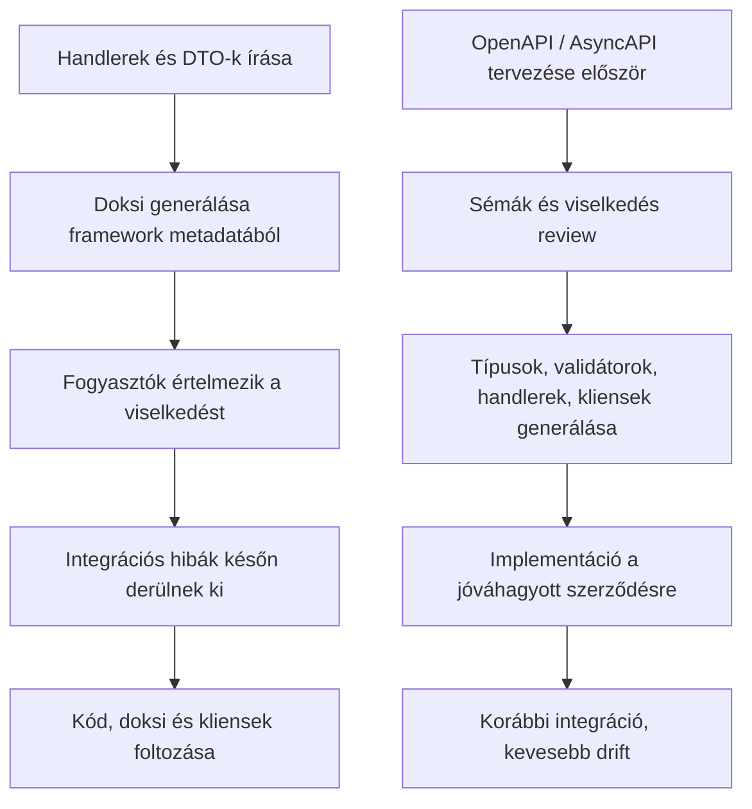
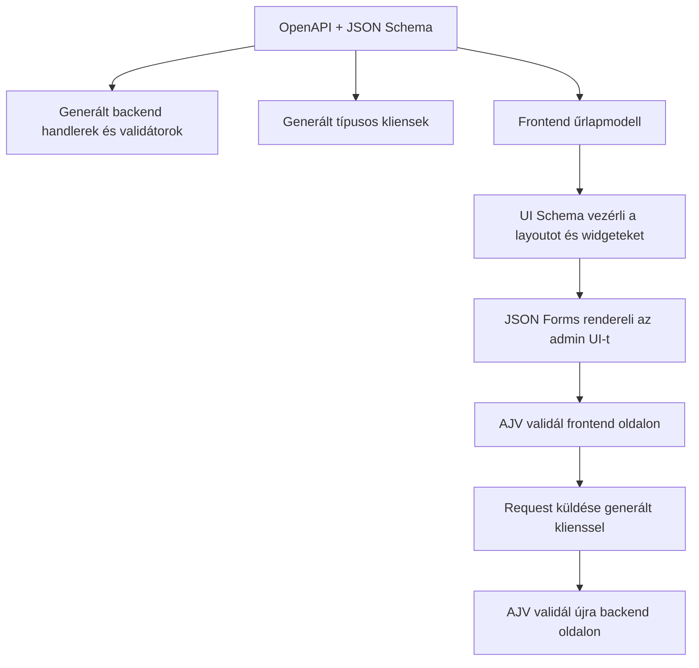
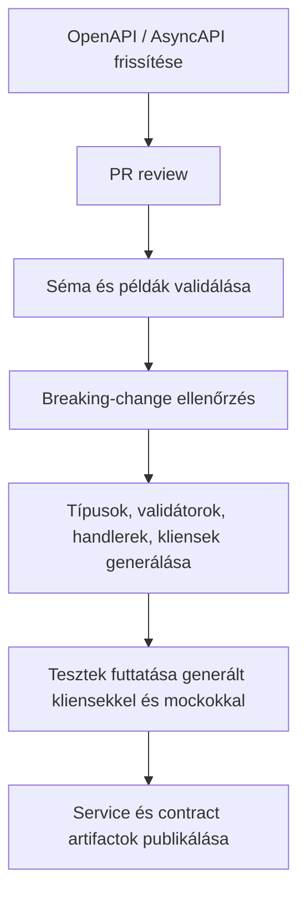

## A szerződésnek meg kell előznie a kódot

A legtöbb csapat még mindig melléktermékként kezeli az API-szerződést.

Először endpoint handlereket írnak. Aztán DTO-kat. Aztán validációt kötnek be. Aztán megpróbálnak dokumentációt kinyerni a futó alkalmazásból. Aztán frontend, QA és más szolgáltatások elkezdenek integrálni. Ekkor jönnek a félreértések: eltérően értelmezett nullable mezők, nem dokumentált edge case-ek, duplikált validációs szabályok, inkonzisztens enumok, ad hoc hibaformátumok, és törékeny klienskód több repositoryban szétszórva.

Kis léptékben ez túlélhető. Platformléptékben viszont delivery-fékké válik.

A spec-first fejlesztés ezt úgy oldja meg, hogy áthelyezi a hangsúlyt. Az implementáció ne implicit módon definiálja az interfészt, hanem az interfész legyen explicit módon előre definiálva, és minden más ebből épüljön.

Ez papíron procedurálisnak tűnhet. A gyakorlatban viszont architekturális.

Amint a szerződés első osztályú forrás-artifact lesz, a design többé nem a controller-kódban rejtve jelenik meg, hanem review-zható, automatizálható és újrahasznosítható lesz.

Modern, elosztott rendszerekben ez jelentős szemléletváltás.

## A szerződés nem dokumentáció

Ez az első igazán fontos gondolkodásbeli váltás.

Egy OpenAPI dokumentum nem csak arra való, hogy Swagger UI-ban böngészhető endpoint-listát adjunk. Egy AsyncAPI dokumentum nem csak topicok és üzenet-payloadok katalógusa. A JSON Schema nem csak validációs formátum.

Ezek együtt a rendszerhatárt írják le olyan formában, amit emberek és eszközök is megértenek.

Ez a határ jóval többet tartalmaz mezőneveknél és primitív típusoknál. Tartalmazza többek között:

- megengedett payload formákat
- kötelező és opcionális mezőket
- formátum- és struktúrakorlátokat
- hiba-szerződéseket
- auth követelményeket
- szerepkör- és scope elvárásokat
- kompatibilitási elvárásokat
- esemény payload definíciókat
- backend és frontend közti közös model szemantikát

Ha ezt a határt előre definiálod, olyan leverage-et kapsz, amit a code-first csapatok jellemzően az asztalon hagynak.

Nem implementációs részletekből próbálod újra összerakni a rendszert. Tudatosan tervezed.

## Hogyan néz ki a code-first a valós rendszerekben

A code-first megközelítés vonzó, mert gyorsnak érződik.

Megírod az endpointot. Dekorálod. Generálsz dokumentációt framework metadatából. Talán DTO-kból vagy TypeScript típusokból inferálsz sémákat. Hatékonynak tűnik, mert a kód a forrásigazság, a docs pedig szinte automatikusan megjelenik.

Ez a kényelem valós, de vannak korlátai.

Egyszerű szolgáltatásoknál működhet elég jól. Nagyobb rendszerekben, főleg ahol több csapat és több repository dolgozik együtt, elkezd szétesni:

- a dokumentáció minősége implementációs részletektől és framework-konvencióktól függ
- a designt gyakran csak azután review-zzák, hogy már kódban létezik
- a generált szerződés gyakran a transport szerkezetet tükrözi, nem a design szándékot
- frontend/backend model drift idővel megjelenik
- a séma újrahasználat szolgáltatásonként inkonzisztens
- a validációs logika túl sok rétegben duplikálódik
- a klienskönyvtárak gyakran gyengék, runtime guard és tiszta típusozás nélkül

Az eredmény: a rendszer technikailag fut, de biztonságosan nehezebb továbbfejleszteni.

Nem az a gond, hogy a code-first mindig rossz. Az a gond, hogy hajlamos az implementációt olyan hellyé tenni, ahol a design döntések véletlenül születnek.

A spec-first ezeket a döntéseket akkor hozza felszínre, amikor még olcsó változtatni.

## A JSON Schema sokkal erősebb, mint amit a csapatok többsége kihasznál

Sok csapat már használ JSON Schemát közvetve, mégsem kezeli stratégiai eszközként.

Látják OpenAPI-ban. Használják validációs tooling mögött. Talán támaszkodnak rá formgenerálásnál vagy konfiguráció validációnál. De még mindig inkább plumbingként tekintenek rá.

Ez kihagyott lehetőség.

A JSON Schema az egyik leghatékonyabb boundary-definíciós eszköz modern backend platformokon. Géppel olvasható modelt ad adatszerkezetekről és megszorításokról, ami végigutazhat a teljes rendszeren:

- API specifikációk
- runtime validáció
- generált típusok
- frontend űrlapok
- mockok
- teszt fixture-ök
- contract diffing
- megosztott platform könyvtárak

Itt jön az igazi érték.

Nem abban, hogy van még egy séma-nyelv, hanem abban, hogy van egy közös reprezentáció, amire a delivery lánc különböző részei konzisztensen támaszkodhatnak.

Amikor a csapatok "single source of truth"-t mondanak, ez az egyik ritka pont, ahol ez tényleg konkrét tartalmat kaphat.

## Spec-first platformszinten

A spec-first legnagyobb előnye általában akkor látszik, amikor nem szolgáltatásonkénti preferenciának, hanem platform-képességnek tekinted.

Mi ezt a Fizz backend platform építése közben tapasztaltuk.

A modell egyszerű:

- az OpenAPI dokumentum statikus YAML-ként van a service forráskódban
- handlerek, típusok és validátorok a szerződésből generálódnak
- AJV fut backend és frontend oldalon is
- CI biztosítja, hogy a HTTP kliensek generálva legyenek és szinkronban maradjanak
- a generált klienseket backend fogyasztók, frontend appok és tesztek is használják
- tesztek mockok ellen tudnak futni URL/módszer/payload részletek hardcode-olása nélkül

Ez nagyon gyakorlatiasan javítja a developer experience-t.

Nem minden fogyasztó próbálja kézzel újra összerakni, hogyan kell hívni egy szolgáltatást, mert a szerződés hajtja a kliensgenerálást. Nem válik szét backend validáció és frontend feltételezés, mert mindkét oldal ugyanazt a séma-szókészletet használja. Nem törnek el feleslegesen tesztek duplikált request-részletek miatt, mert a generált kliensek stabil integrációs felületet adnak.

A fejlesztői visszajelzés egyértelmű volt: jobb lett a DX, mert nem kell interfész-apróságokat fejben tartani.

Ez nem apró javulás. Pont ez az ismétlődő kognitív overhead lassítja csendben a csapatokat.

## Statikus OpenAPI mint forrás-artifact, nem exportált artifact

Egy finom, de fontos részlet, hogy hol él a szerződés.

Sok code-first setupban az API dokumentum futó alkalmazásból generálódik. Ez olyan függőségi láncot hoz létre, ahol a szerződés a kódból származik, és gyakran csak fordítás vagy boot után áll stabilan rendelkezésre.

Ha a statikus OpenAPI YAML be van commitolva a service forráskódba, ez megfordítja a viszonyt.

A specifikáció a service futása előtt létezik. Review-zható pull requestben. Önállóan lintelhető és validálható. Részt vehet code generationben, breaking-change ellenőrzésben, dokumentáció publikálásban és teszteszközökben, még az implementáció befejezése előtt.

Ekkor a szerződés fejlesztési input lesz, nem runtime melléktermék.

És ha ezt a váltást megléped, az architektúra irányítása lényegesen könnyebb.

## Vizuál: implementáció-first vs spec-first

## A generált kliensek nem csak kényelmi kódok

A generált klienseket gyakran pusztán produktivitási funkciónak tekintik. Ez igaz, de nem teljes kép.

A fontosabb előny az, hogy helyességet kódolnak.

Generált kliensek nélkül a fogyasztók általában kézzel ismétlik az interfészt:

- útvonalak és query paraméterek kézzel épülnek
- HTTP metódusok emlékezetből ismétlődnek
- auth headerek inkonzisztensen készülnek
- request/response típusozás hiányos
- a hibakezelés fogyasztónként eltér
- tesztek endpoint részleteket hardcode-olnak
- topic nevek vagy payload formák eldriftelnek event-alapú rendszereknél

Minden egyes ismétlés újabb eltérésforrás.

Ha a CI biztosítja, hogy a kliensek a friss szerződésből generálódjanak, ennek a hibakategóriának nagy részét kivágod. A fogyasztók nem emlékezetre és konvencióra támaszkodnak, hanem a szerződésből származtatott artifactokra.

Nálunk ez a tesztelést is javította. A generált klienseket end-to-mock tesztekben is használjuk, vagyis a tesztek ugyanazon contract-driven felületen futnak, mint a production fogyasztók. Nincs duplikált URL, nincs kézzel írt fetch wrapper, nincs magic string metódusokra.

Ez jelentős minőségi nyereség, mert teljes törékenységi osztályokat tüntet el.

## A runtime validáció legalább olyan fontos, mint a statikus típusozás

TypeScript-heavy rendszerekben visszatérő hiba azt gondolni, hogy compile-time típusok elegendők.

Nem elegendők.

A TypeScript fejlesztés közben segít az elvárt alakzatokban gondolkodni. De runtime-on nem validál külső inputot. Nem véd meg rossz payloadoktól más szolgáltatásokból, régebbi kliensektől, részben rolloutolt fogyasztóktól vagy külső integrációktól.

Itt lesz kulcsfontosságú a JSON Schema + AJV.

Ha a handlerek, kliensek és űrlapok ugyanabból a séma-családból épülnek, a runtime validáció konzisztenssé válik rendszerhatárokon át.

Ez backend oldalon fontos inbound requesteknél és sokszor outbound szerződések védelmében is. Frontenden is fontos, ahol felhasználói inputot kell validálni, és biztosítani kell, hogy a kiküldött payload megfeleljen az API szerződésnek.

Az AJV kétoldali használata lezárja a rést a statikus szándék és a runtime valóság között.

Egy jó típusrendszer megmondja, minek kellene történnie.
Egy jó validátor megmutatja, mi történt ténylegesen.

Mindkettő kell.

## A frontend előnyöket gyakran alábecsülik

A spec-first beszélgetések gyakran backend-központúak. Ez hiba, mert a legnagyobb leverage-ek egy része frontend és admin tooling oldalon jelenik meg.

Ha az API-k JSON Schema-alapú szerződésekkel leírtak, és ugyanazok a sémák a frontend számára is elérhetők, sokkal többet lehet tenni annál, mint kliensgenerálás.

Például a **JSON Forms** jelentősen gyorsíthatja az admin felületek fejlesztését.

Ez nem azt jelenti, hogy "generáljuk le az egész frontendet sémából". Ez customer-facing UX-re általában túl egyszerű. De belső toolinghoz, admin backoffice-hoz, operációs felületekhez, konfigurációs képernyőkhöz és workflow űrlapokhoz a schema-driven UI óriási gyorsító lehet.

Különösen jól működik, ha a felelősségeket tisztán szétválasztod:

- **JSON Schema** írja le az adat-szerződést és validációs szemantikát
- **UI Schema** írja le az elrendezést és megjelenítési döntéseket
- **AJV** validálja az űrlapadatot ugyanazzal a séma-modellel, mint amit az API szerződés használ

Ez erős end-to-end illeszkedést ad:

1. A backend szerződés definiálja, mi számít érvényes payloadnak.
2. A frontend űrlap ugyanebből a séma-családból generálható vagy erősen támogatható.
3. A UI schema irányítja a renderelést, csoportosítást, widgeteket és layoutot.
4. A beküldött payload küldés előtt validálható.
5. A backend ugyanazt a struktúrát validálja fogadáskor.

Ez lényegesen tisztább modell, mint minden rétegben külön-külön kézzel újraimplementálni mezőket, szabályokat és szerkezeti elvárásokat.

Admin felületeknél ez drámaian csökkentheti az ismétlődő UI kód mennyiségét, miközben növeli a konzisztenciát.

## JSON Forms és schema-driven admin felületek

Egyedi szoftverfejlesztési szempontból itt válik igazán érdekessé a téma.

A belső platformok gyakran szenvednek az operációs űrlapok és admin felületek hosszú farok-problémájától:

- termékattribútum szerkesztők
- árazási konfigurációk
- integrációs setup képernyők
- szabály- és policy szerkesztők
- merchant onboarding űrlapok
- support eszközök
- feature konfigurációs panelek

Ezek a felületek fontosak, de ritkán differenciálnak üzletileg. Leginkább pontosnak, karbantarthatónak és gyorsan változtathatónak kell lenniük.

Itt kifejezetten jól működik a schema-driven megközelítés.

JSON Forms-szal vagy hasonló eszközökkel a struktúrát és validációt JSON Schemában definiálod, a megjelenítést UI schema-val irányítod, miközben szigorú kompatibilitást tartasz a backend szerződéssel.

Ennek kézzelfogható előnyei:

- jóval kevesebb duplikált mezőmodellezés
- konzisztens validációs üzenetek és szabályok
- gyorsabb új admin felületek létrehozása
- alacsonyabb karbantartási költség séma-evolúció során
- nagyobb bizalom abban, hogy a beküldött adat megfelel az API szerződésnek
- könnyebb onboarding belső eszközöket fejlesztő mérnököknek

A lényeg nem a vak kódgenerálás. A lényeg a szerződésmodell kontrollált újrahasznosítása.

Ha jól csinálod, ez nem "generált UI" érzetet ad, hanem "olyan platformot, ami megszünteti a felesleges ismétlést".

## Vizuál: schema-driven folyamat API-tól az admin UI-ig

## Aszinkron rendszerek még többet nyernek explicit szerződésekkel

A spec-first különösen fontossá válik, ha a rendszer nem tisztán szinkron.

HTTP-nél legalább láthatók az interfészek: vannak útvonalak, metódusok, státuszkódok. Üzenetközpontú rendszereknél a felület sokkal kevésbé önleíró, ahogy nő a rendszer. Szaporodnak a topicok. Informálisan változnak a payloadok. Hasonló események jelennek meg eltérő szemantikával. A fogyasztók nem dokumentált feltételezésekre támaszkodnak.

Itt lesz kritikus az AsyncAPI és a fegyelmezett séma-újrahasználat.

Event-driven rendszerekben a kétértelműség veszélyesebb, mert a hibák gyakran késleltetve és szétterülve jelennek meg. Egy hibás feltételezés nem mindig bukik el hangosan. Csendben torzíthat downstream viselkedést, vagy olyan integrációt törhet el, amit drága visszakövetni.

Az explicit event szerződések segítenek definiálni:

- üzenet payloadokat
- ownership határokat
- verziózási megközelítést
- korrelációs azonosítókat
- kompatibilitási elvárásokat
- példákat és szemantikai szándékot

Ugyanaz az elv érvényes, mint HTTP API-knál: ha a szerződés első osztályú artifact, részt vehet validációban, review-ban, generálásban és governance-ben.

Enélkül az event-driven architektúrák hajlamosak láthatatlan csatolást felhalmozni.

## A biztonság és jogosultságkezelés könnyebben standardizálható

A spec-first a security gondolkodást is javítja.

Túl sok rendszerben az authorization csak azután kerül be, hogy az interfészalak már eldőlt. Endpointok kódban válnak védetté, szerepkörök implikáltak maradnak, a policy elvárások szétszóródnak annotációk, middleware-ek és service-specifikus konvenciók között.

Contract-first megközelítésben jobb helyre kerülnek ezek az információk.

Ha scope-ok, auth sémák és védett műveletek a szerződésben jelennek meg, több minden könnyebb lesz:

- a security szándék korábban review-zható
- a generált artifactok konzisztensen értelmezik az auth követelményeket
- a fogyasztó csapatok tudják, milyen credential/scope szükséges
- a hiányosságok design review során derülnek ki, nem rollout után

Ez nem váltja ki a jó authorization architektúrát, de a biztonság szempontjából kritikus információt oda teszi, ahová tartozik: az interfész mellé.

Platformcsapatoknál ennek nagy jelentősége van.

## A párhuzamos fejlesztés reális lesz, nem vágyálom

A spec-first egyik legnagyobb szervezeti előnye, hogy kevésbé kockázatos a párhuzamos munka.

Amint a szerződés elég stabil:

- a backend implementálhat handlereket
- a frontend használhat generált klienseket
- a QA előállíthat teszteseteket és fixture-öket
- mockok készülhetnek a specifikációból
- az integrációs tesztelés korábban elindulhat
- fogyasztó szolgáltatások fejleszthetnek a szerződésre, teljesen kész provider nélkül

Ez csökkenti azokat a koordinációs szűk keresztmetszeteket, amelyek service-oriented deliveryben könnyen normává válnak.

Ahelyett, hogy a csapatok bizonytalanság miatt egymásra várnak, kapsz egy közös artifactot, amely eléggé leszűkíti a bizonytalanságot a párhuzamos munkához.

Ez az egyik fő ok, amiért a spec-first nagyon jól skálázódik többcsapatos termékszervezetekben.

## A CI az a hely, ahol ez valóban kikényszeríthető

Az előre megírt szerződés hasznos. A CI által kikényszerített szerződés transzformatív.

Ha a CI biztosítja, hogy a specifikáció érvényes, és a generált artifactok naprakészek maradnak, sokkal nehezebb véletlenül megkerülni a folyamatot.

Érett setupban tipikus ellenőrzések:

- OpenAPI vagy AsyncAPI validáció
- séma lintelés
- breaking-change detektálás
- handlerek, típusok, validátorok és kliensek generálása
- ellenőrzés, hogy a generált kód helyesen commitolva/publikálva van
- tesztek futtatása generált kliensekkel és mockokkal

Ez a különbség aközött, hogy "mi szeretjük a contract-firstet" és aközött, hogy "a platformunk contract-driven".

Az utóbbi jóval erősebb, mert nem kizárólag memóriára és csapatfegyelemre épít.

## Vizuál: spec-first platform workflow

## Hol csúszhat félre a spec-first

A spec-first nem varázslat.

Ha gyengék a sémák, rossz minőségűek a generált artifactok, vagy a csapat bürokratikus teherként kezeli a specifikációt, a folyamat nehézkessé válhat valódi nyereség nélkül.

Tipikusan akkor bukik meg, ha:

- a spec meg van írva, de nem autoritatív
- validáció csak az egyik oldalon létezik
- hiányoznak a példák
- gyenge minőségű a generált kód
- homályos a verziózás és kompatibilitási szabályok
- túlzottan aprólékos modellkényszer jelenik meg
- senki nem tulajdonosa a contract lifecycle-nak

A megoldás nem az, hogy elengedjük a megközelítést. A megoldás a szelektív, fegyelmezett alkalmazás.

Ott használd, ahol a szerződés számít. Tedd autoritatívvá a specifikációt. Tartsd olvashatón a sémákat. Azokat az artifactokat generáld, amelyek valódi leverage-et adnak. CI-ben kényszerítsd ki a folyamatot. A contract review-t kezeld design review-ként.

Itt kezdenek összetetten megtérülni az előnyök.

## Miért lesz ez fontosabb, ahogy érik a rendszer

Korai fázisban szinte bármilyen interfész-megközelítés elfogadhatónak tűnhet, mert kevés a fogyasztó és szoros a visszacsatolás.

Ahogy érik a rendszer, megváltozik a költségprofil.

Ekkor már van:

- több szolgáltatás
- több frontend felület
- több csapat
- több környezet
- nagyobb backward kompatibilitási nyomás
- erősebb governance elvárás
- több üzemeltetési eszköz
- nagyobb igény megbízható automatizációra

Ezen a ponton az interfész már nem lokális implementációs részlet. A platform részévé válik.

Pont itt kezdi a spec-first egyértelműen felülmúlni a code-first megközelítést.

Mert a valódi érték nem az, hogy a szerződés dokumentált. Hanem az, hogy a szerződés a teljes delivery pipeline-ban végrehajthatóvá válik.

## Összefoglalás

A spec-first nem arról szól, hogy szebb API dokumentáció készüljön.

Arról szól, hogy a szerződések elég korán explicit formát kapjanak ahhoz, hogy ugyanarra a forrásmodellre tudjon támaszkodni tooling, teszt, validátor, kliens és csapat.

Ezért érdemes a JSON Schemára nagyobb hangsúlyt tenni. Nem puszta validációs plumbing. Olyan összekötő szövet, amely egységes workflow-ba tudja kapcsolni az API designt, runtime biztonságot, kliensgenerálást, admin UI gyorsítást és platform governance-t.

A Fizz backend platformon ez különösen tisztán látszott:

- statikus OpenAPI a service forráskódban
- generált handlerek, típusok és validátorok
- AJV backend és frontend oldalon
- CI által kikényszerített kliensgenerálás
- generált kliensek használata service-ekben, frontendben és tesztekben
- schema-driven admin UI gyorsítás JSON Forms-szal

Az eredmény nem csak jobb dokumentáció. Hanem jobb developer experience, kevesebb duplikált munka, kevesebb integrációs meglepetés, és biztonságosabban evolválható platform.

Ha a csapatod már használ OpenAPI-t, AsyncAPI-t vagy JSON Schemát, valószínűleg közelebb vagytok ehhez a modellhez, mint gondolnátok.

A valódi kérdés az, hogy a szerződések csak utólag leírják-e a rendszert, vagy aktívan formálják is, hogyan épül fel.

Ebben a különbségben van a leverage.
