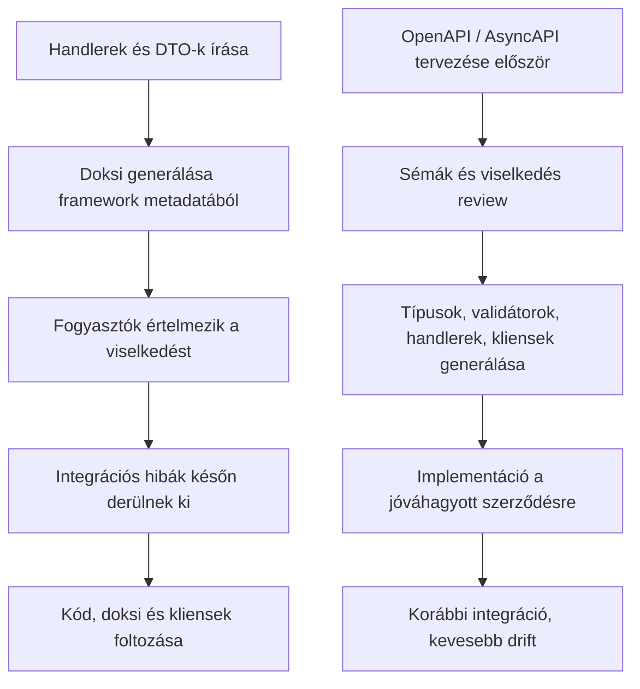
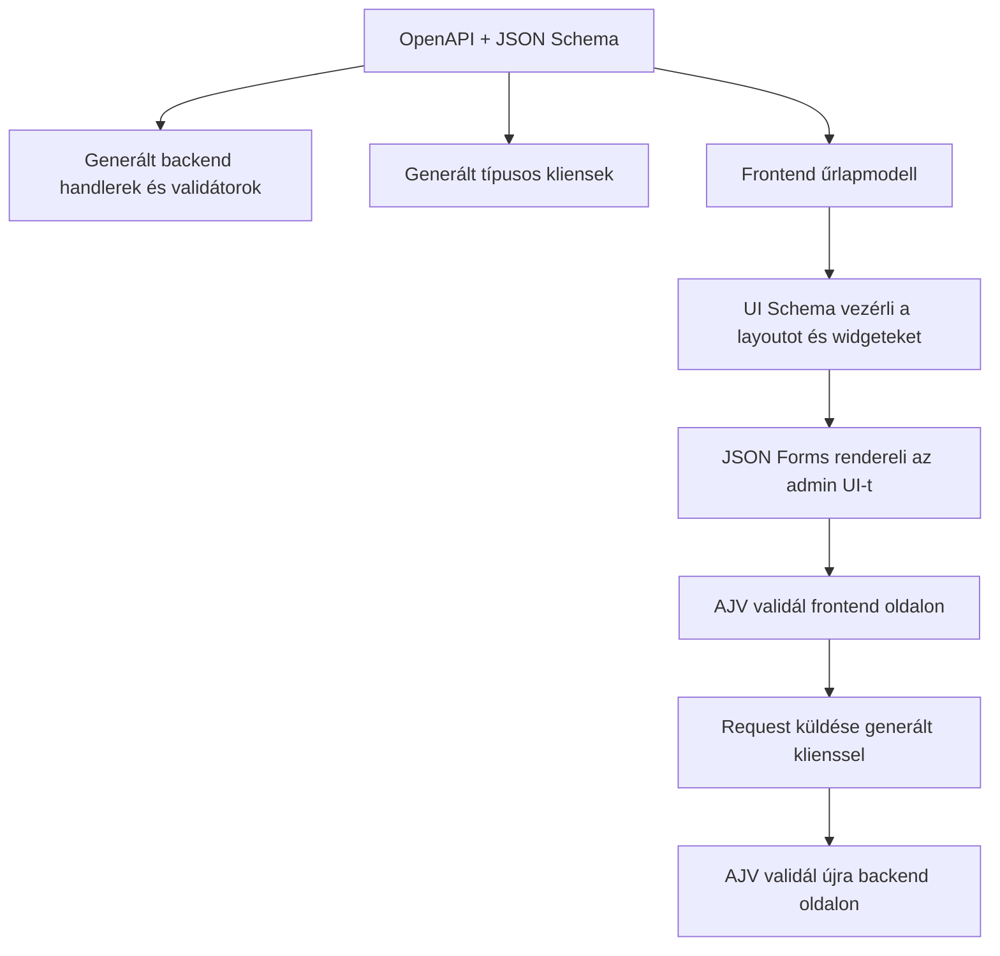
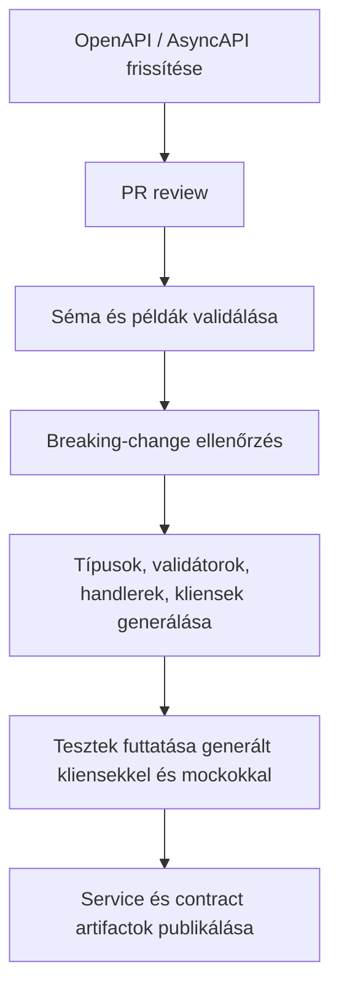

## Kezdd a szerződéssel

Sok csapat még mindig melléktermékként kezeli az API-szerződést. Endpoint handlereket írnak, DTO-kat és validációt adnak hozzá, majd a futó alkalmazásból próbálnak dokumentációt kinyerni. Mire a frontend, a QA és más szolgáltatások integrálni kezdenek, a nullable mezőket, enumokat, edge case-eket és hibaformátumokat már eltérően értelmezik. A klienskód közben több repositoryban is szétszóródott.

Kis léptékben ez túlélhető. Platformléptékben viszont delivery-fékké válik.

A spec-first fejlesztés az implementáció elé hozza ezeket a döntéseket. Amint a szerződés első osztályú forrás-artifact lesz, a design többé nem a controller-kódban rejtőzik. A csapatok review-zhatják, generálhatnak belőle, és újrahasznosíthatják a rendszerhatárokon át.

## A szerződés a delivery egyik bemenete

Az OpenAPI többre képes, mint feltölteni a Swagger UI-t. Az AsyncAPI nemcsak topicokat katalogizál, a JSON Schema pedig nemcsak payloadot validál.

Ezek együtt a rendszerhatárt írják le olyan formában, amit emberek és eszközök is megértenek.

Ez a határ jóval többet tartalmaz mezőneveknél és primitív típusoknál. Rögzíti a megengedett payloadformákat, a kötelező mezőket, valamint a formátum- és struktúrakorlátokat. Ide tartoznak a hibák, az authentikáció, a szerepkörök és scope-ok, a kompatibilitási szabályok, az eseménypayloadok, továbbá a backend és frontend közös modelszemantikája is.

Az előre definiált határ közös tervet ad a csapatoknak, így nem implementációs részletekből kell utólag összerakniuk a rendszert.

## Hogyan néz ki a code-first a valós rendszerekben

A code-first megközelítés gyorsnak érződik: megírod az endpointot, dekorálod, majd dokumentációt generálsz framework metadatából. Egyes eszközök DTO-kból vagy TypeScript típusokból sémát is inferálnak. Ez a kényelem hasznos, különösen kis szolgáltatásnál, de a design csak akkor válik review-zhatóvá, amikor már kód lett belőle.

Egyszerű szolgáltatásoknál működhet elég jól. Nagyobb rendszerekben a dokumentáció minősége a framework-konvenciókhoz kötődik, a designt pedig csak akkor review-zzák, amikor már kódban létezik. A generált szerződés inkább a transport szerkezetet tükrözi, mint a tervezői szándékot. Idővel eltér a backend- és frontendmodell, inkonzisztenssé válik a séma-újrahasználat, duplikálódik a validáció, a klienskönyvtárakban pedig hiányos típusozás vagy runtime guard marad.

A code-first nem mindig rossz választás. Arra viszont hajlamos, hogy az implementáció legyen az a hely, ahol az interfészdöntések véletlenül megszületnek. A spec-first akkor teszi őket review-zhatóvá, amikor még olcsó változtatni.

## A JSON Schema sokkal erősebb, mint amit a csapatok többsége kihasznál

Sok csapat már használ JSON Schemát közvetve. Megjelenik OpenAPI-ban, validációs toolingban, formgenerálásban és konfiguráció-ellenőrzésben, mégis gyakran plumbingként kezelik ahelyett, hogy a rendszerhatárok közös leírását látnák benne.

A JSON Schema az egyik leghatékonyabb boundary-definíciós eszköz modern backend platformokon. Az adatszerkezetek és megszorítások géppel olvasható modelljéből API-specifikáció, runtime validáció, generált típus, frontend űrlap, mock, tesztfixture, contract diff és közös platformkönyvtár is készülhet.

Az értéke abból jön, hogy a delivery lánc különböző részei ugyanarra a reprezentációra támaszkodhatnak, nem abból, hogy van még egy séma-nyelv.

Amikor a csapatok "single source of truth"-t mondanak, ez az egyik ritka pont, ahol ez tényleg konkrét tartalmat kaphat.

## Spec-first platformszinten

A legnagyobb előnyt a Fizz backend platform építése közben láttuk, ahol a spec-first szolgáltatásonkénti preferencia helyett platform-képesség lett.

Az OpenAPI dokumentum statikus YAML-ként él a service forrásában. Handlereket, típusokat és validátorokat generálunk belőle, az AJV pedig backend- és frontendoldalon is fut. A CI szinkronban tartja a backend fogyasztók, frontendalkalmazások és tesztek HTTP-klienseit. A tesztek így mockok ellen futhatnak URL-ek, metódusok és payloadfeltételezések hardcode-olása nélkül.

A szerződés hajtja a kliensgenerálást, ezért a fogyasztók nem rakják össze kézzel a service-hívásokat. A backend validáció és a frontend feltételezések ugyanazt a séma-szókészletet használják, a generált kliensek pedig megóvják a teszteket a request-részletek duplikálásától.

A fejlesztők szerint jobb lett a DX, mert nem kell interfészrészleteket fejben tartani. Az egyes hívásoknál megtakarított idő kicsi, de szolgáltatásokon és repókon át összeadódik.

## Statikus OpenAPI mint forrás-artifact, nem exportált artifact

Egy finom, de fontos részlet, hogy hol él a szerződés.

Sok code-first setupban az API dokumentum futó alkalmazásból generálódik. Ez olyan függőségi láncot hoz létre, ahol a szerződés a kódból származik, és gyakran csak fordítás vagy boot után áll stabilan rendelkezésre.

A service forrásába commitolt statikus OpenAPI YAML megfordítja ezt a függőséget. A specifikáció már a service futása előtt létezik, pull requestben review-zható, önállóan lintelhető és validálható. Code generationt, breaking-change ellenőrzést, dokumentációpublikálást és teszteszközöket hajthat még az implementáció elkészülte előtt. A szerződés így a platform által irányítható fejlesztési inputtá válik.

## Vizuál: implementáció-first vs spec-first

## A generált kliensek kiváltják a duplikált interfészkódot

A generált kliensek időt takarítanak meg, de tartósabb előnyük a konzisztencia.

Generált kliensek nélkül a fogyasztók kézzel másolják le az interfészt. Helyben építik össze az útvonalakat és query paramétereket, emlékezetből választanak HTTP-metódust, az auth headereket pedig kliensenként eltérően kötik be. A request- és response-típusozás gyakran hiányos, a hibakezelés változó, a tesztek endpoint-részleteket hardcode-olnak, az event-alapú rendszerek topicnevei és payloadformái pedig idővel eltérnek.

Minden ismétlés újabb helyet ad az implementáció és a fogyasztók eltérésének.

Ha a CI biztosítja, hogy a kliensek a friss szerződésből generálódjanak, ennek a hibakategóriának nagy részét kivágod. A fogyasztók nem emlékezetre és konvencióra támaszkodnak, hanem a szerződésből származtatott artifactokra.

Nálunk ez a tesztelést is javította. A generált klienseket end-to-mock tesztekben is használjuk, vagyis a tesztek ugyanazon contract-driven felületen futnak, mint a production fogyasztók. Nincs duplikált URL, nincs kézzel írt fetch wrapper, nincs magic string metódusokra.

A tesztek kevésbé lesznek törékenyek, mert nem hordozzák az interfész második, kézzel írt változatát.

## A típusok runtime előtt véget érnek

A TypeScript fejlesztés közben segít az elvárt alakzatokban gondolkodni, de runtime-on nem validál külső inputot. Rossz payload továbbra is érkezhet más szolgáltatásból, régebbi kliensből, részben rolloutolt fogyasztótól vagy külső integrációból.

Ha a handlerek, kliensek és űrlapok ugyanabból a séma-családból épülnek, a runtime validáció konzisztenssé válik rendszerhatárokon át.

Ez backend oldalon fontos inbound requesteknél és sokszor outbound szerződések védelmében is. Frontenden is fontos, ahol felhasználói inputot kell validálni, és biztosítani kell, hogy a kiküldött payload megfeleljen az API szerződésnek.

Az AJV kétoldali használata lezárja a rést a statikus szándék és a runtime valóság között.

A típusrendszer leírja, mit vár a saját kódod. A validátor ellenőrzi, mi lépte át ténylegesen a rendszerhatárt. Mindkettő kell.

## Ugyanazok a sémák a frontendet is segíthetik

A spec-first beszélgetések gyakran backend-központúak, pedig a frontend és az admin tooling is újrahasznosíthatja ugyanazokat a sémákat.

Ha az API-k JSON Schema-alapú szerződésekkel leírtak, és ugyanazok a sémák a frontend számára is elérhetők, sokkal többet lehet tenni annál, mint kliensgenerálás.

Például a **JSON Forms** jelentősen gyorsíthatja az admin felületek fejlesztését.

Egy teljes customer-facing frontend generálása sémából általában túl durva eszköz. Belső toolingnál, admin backoffice-nál, operációs felületeknél, konfigurációs képernyőknél és workflow űrlapoknál viszont a schema-driven UI sok ismétlődő munkát kiválthat.

Különösen jól működik, ha a felelősségeket tisztán szétválasztod:

- **JSON Schema** írja le az adat-szerződést és validációs szemantikát
- **UI Schema** írja le az elrendezést és megjelenítési döntéseket
- **AJV** validálja az űrlapadatot ugyanazzal a séma-modellel, mint amit az API szerződés használ

Ez erős end-to-end illeszkedést ad:

1. A backend szerződés definiálja, mi számít érvényes payloadnak.
2. A frontend űrlap ugyanebből a séma-családból generálható vagy erősen támogatható.
3. A UI schema irányítja a renderelést, csoportosítást, widgeteket és layoutot.
4. A beküldött payload küldés előtt validálható.
5. A backend ugyanazt a struktúrát validálja fogadáskor.

Így nem kell minden rétegben külön kézzel újraimplementálni a mezőket, szabályokat és szerkezeti elvárásokat. Az admin felületek kevesebb ismétlődő UI kódot igényelnek, és közelebb maradnak az API-szerződéshez.

## JSON Forms és schema-driven admin felületek

A belső platformokon könnyen felhalmozódik az operációs űrlapok hosszú sora: termékattribútum-szerkesztők, árazási konfigurációk, integrációs setupok, szabály- és policy-szerkesztők, merchant onboarding, supporteszközök és feature-konfigurációs panelek.

Ezek a felületek fontosak, de ritkán differenciálják a terméket. Pontosnak, karbantarthatónak és könnyen változtathatónak kell lenniük; a mezők többségéhez nem kell egyedi UX.

JSON Forms-szal vagy hasonló eszközökkel a struktúrát és validációt JSON Schemában definiálod, a megjelenítést UI schema-val irányítod, miközben szigorú kompatibilitást tartasz a backend szerződéssel.

Ugyanaz a modell kiváltja a duplikált meződefiníciókat és konzisztensen tartja a validációs üzeneteket. Gyorsabban készülnek el az új admin felületek, olcsóbb követni a sémaváltozásokat, a beküldött adat közelebb marad az API-szerződéshez, és a fejlesztők hamarabb kiismerik a belső toolingot.

A cél a szerződésmodell kontrollált újrahasznosítása. Nem az, hogy minden képernyőt vakon generáljunk.

## Vizuál: schema-driven folyamat API-tól az admin UI-ig

## Az eventszerződések láthatóvá teszik a rejtett csatolást

A spec-first különösen fontossá válik, ha a rendszer nem tisztán szinkron.

HTTP-nél legalább láthatók az interfészek: vannak útvonalak, metódusok, státuszkódok. Üzenetközpontú rendszereknél a felület sokkal kevésbé önleíró, ahogy nő a rendszer. Szaporodnak a topicok. Informálisan változnak a payloadok. Hasonló események jelennek meg eltérő szemantikával. A fogyasztók nem dokumentált feltételezésekre támaszkodnak.

Az AsyncAPI és a fegyelmezett séma-újrahasználat látható formát ad ezeknek a függőségeknek.

Event-driven rendszerekben a kétértelműség veszélyesebb, mert a hibák gyakran késleltetve és szétterülve jelennek meg. Egy hibás feltételezés nem mindig bukik el hangosan. Csendben torzíthat downstream viselkedést, vagy olyan integrációt törhet el, amit drága visszakövetni.

Az explicit eventszerződések rögzítik az üzenetpayloadokat és ownership határokat, továbbá a verziózási megközelítést, korrelációs azonosítókat, kompatibilitási szabályokat, példákat és szemantikai szándékot.

Ahogy a HTTP API-knál, úgy itt is részt vehet a forráskódban tárolt szerződés a validációban, review-ban, generálásban és governance-ben. Enélkül az event-driven rendszer olyan csatolást halmoz fel, amelyet nehéz észrevenni, amíg egy fogyasztó el nem törik.

## A security szándék kerüljön az interfész mellé

Túl sok rendszerben az authorization csak azután kerül be, hogy az interfészalak már eldőlt. Endpointok kódban válnak védetté, szerepkörök implikáltak maradnak, a policy elvárások szétszóródnak annotációk, middleware-ek és service-specifikus konvenciók között.

Ha scope-ok, auth sémák és védett műveletek a szerződésben jelennek meg, több minden könnyebb lesz:

- a security szándék korábban review-zható
- a generált artifactok konzisztensen értelmezik az auth követelményeket
- a fogyasztó csapatok tudják, milyen credential/scope szükséges
- a hiányosságok design review során derülnek ki, nem rollout után

Ez nem váltja ki a jó authorization architektúrát. A security szándékot viszont az interfész mellé teszi, ahol a reviewerek és a fogyasztók is látják.

## Stabil szerződés mellett a csapatok párhuzamosan dolgozhatnak

Amint a szerződés elég stabil:

- a backend implementálhat handlereket
- a frontend használhat generált klienseket
- a QA előállíthat teszteseteket és fixture-öket
- mockok készülhetnek a specifikációból
- az integrációs tesztelés korábban elindulhat
- fogyasztó szolgáltatások fejleszthetnek a szerződésre, teljesen kész provider nélkül

A közös artifact eléggé leszűkíti a bizonytalanságot a párhuzamos munkához. A backendnek, frontendnek, QA-nak és a fogyasztó szolgáltatásoknak nem kell egy deployolt providerre várniuk ahhoz, hogy haladjanak.

## A CI tartja autoritatívan a szerződést

Ha a CI biztosítja, hogy a specifikáció érvényes, és a generált artifactok naprakészek maradnak, sokkal nehezebb véletlenül megkerülni a folyamatot.

Érett setupban tipikus ellenőrzések:

- OpenAPI vagy AsyncAPI validáció
- séma lintelés
- breaking-change detektálás
- handlerek, típusok, validátorok és kliensek generálása
- ellenőrzés, hogy a generált kód helyesen commitolva/publikálva van
- tesztek futtatása generált kliensekkel és mockokkal

Ezek az ellenőrzések autoritatívvá teszik a szerződést, így a contract-first nem marad memóriától és csapatfegyelemtől függő preferencia.

## Vizuál: spec-first platform workflow

## Hol csúszhat félre a spec-first

Gyenge sémák, rossz minőségű generált artifactok vagy bürokratikus teherként kezelt specifikáció mellett a folyamat nehézkessé válhat anélkül, hogy sokat adna.

Tipikusan akkor bukik meg, ha:

- a spec meg van írva, de nem autoritatív
- validáció csak az egyik oldalon létezik
- hiányoznak a példák
- gyenge minőségű a generált kód
- homályos a verziózás és kompatibilitási szabályok
- túlzottan aprólékos modellkényszer jelenik meg
- senki nem tulajdonosa a contract lifecycle-nak

Ott használd a spec-first megközelítést, ahol a szerződés számít. Tartsd olvashatón a sémákat, csak olyan artifactokat generálj, amelyek munkát váltanak ki vagy eltérést előznek meg, kényszerítsd ki a folyamatot CI-ban, és kezeld a contract review-t design review-ként.

## A fogyasztók számával együtt nő a megtérülés

Egy termék életének elején szinte bármilyen interfész-megközelítés működhet, mert kevés a fogyasztó és szoros a visszacsatolás. A szolgáltatások, csapatok, környezetek és kompatibilitási elvárások szaporodásával megváltozik a költségprofil.

A több szolgáltatás, frontend felület, csapat és környezet nagyobb kompatibilitási nyomást, erősebb governance-elvárást, több üzemeltetési eszközt és megbízhatóbb automatizációt igényel. Az interfész ekkor már a platform része, nem lokális implementációs részlet. A spec-first azért térül meg, mert a szerződés a teljes delivery pipeline-ban végrehajtható, nemcsak dokumentálja azt.

## Dolgoztasd meg a szerződést

A spec-first elég korán ad explicit formát a szerződéseknek ahhoz, hogy tooling, teszt, validátor, kliens és csapat ugyanarra a forrásmodellre támaszkodhasson.

A JSON Schema össze tudja kapcsolni az API designt, runtime biztonságot, kliensgenerálást, admin UI generálást és platform governance-t. Ha csak validációs plumbingként kezeljük, ennek nagy része kihasználatlan marad.

A Fizz backend platformon ez statikus, a service forrásában tárolt OpenAPI-t, generált handlereket, típusokat és validátorokat, valamint backend- és frontendoldali AJV-t jelent. A CI naprakészen tartja a service-ekben, frontendkódban és tesztekben használt generált klienseket; a JSON Forms pedig ugyanazokat a sémákat használja az admin UI fejlesztéséhez.

Az eredmény jobb developer experience, kevesebb duplikált munka, kevesebb integrációs meglepetés és biztonságosabban evolválható platform.

Ha a csapatod már használ OpenAPI-t, AsyncAPI-t vagy JSON Schemát, a következő lépés az, hogy ezek a szerződések utólagos leírás helyett ténylegesen formálják a rendszer építését.
