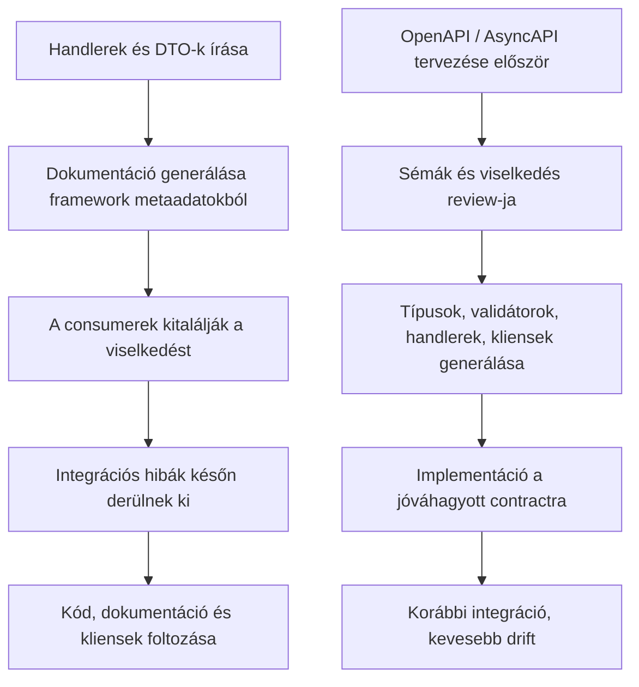
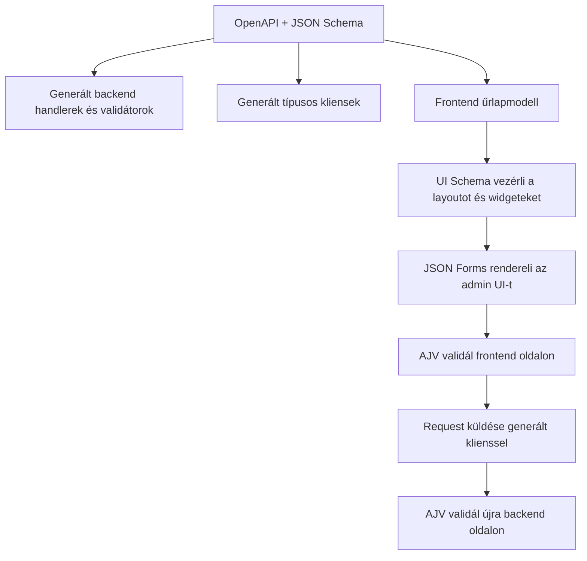
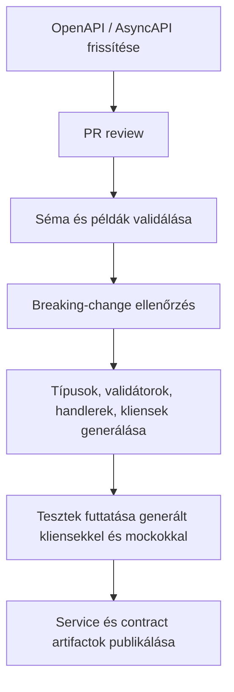

## Kezdjük a contracttal

Sok csapat még mindig melléktermékként kezeli az API contractot. Megírják az endpoint handlereket, hozzáadják a DTO-kat és a validációt, majd a futó alkalmazásból próbálnak dokumentációt kinyerni. Mire a frontend, a QA és a többi szolgáltatás bekötné magát, mindenki másként értelmezi a nullable mezőket, az enumokat, az edge case-eket és a hibaformátumokat. A klienskód közben több repositoryba szóródott szét.

Kis méretben ezzel még együtt lehet élni. Platformméretben viszont fékezi a delivery-t.

A spec-first fejlesztés ezeket a döntéseket az implementáció elé hozza. Ha a contract teljes jogú forrásfájl, a design nem bújik el a controller-kódban: a csapatok review-zhatják, kódot generálhatnak belőle, és több rendszerben is újrahasznosíthatják.

## A contract a delivery egyik alapja

Az OpenAPI nem csak arra jó, hogy legyen mit mutatnia a Swagger UI-nak. Az AsyncAPI nem csak egy topiclista, a JSON Schema pedig nem csak payloadvalidátor.

Együtt a rendszerhatárt írják le olyan formában, amelyet emberek és eszközök egyaránt megértenek.

Ez a határ jóval több a mezőneveknél és a primitív típusoknál. Rögzíti a megengedett payloadokat, a kötelező mezőket, a formátumra és a szerkezetre vonatkozó megkötéseket. Ide tartoznak a hibák, az authentikáció, a szerepkörök és scope-ok, a kompatibilitási szabályok, az eseménypayloadok, valamint a backend és a frontend által közösen használt modellek jelentése is.

Az előre definiált határ közös tervet ad a csapatoknak, így nem implementációs részletekből kell utólag összerakniuk a rendszert.

## Hogyan működik a code-first a gyakorlatban

A code-first megközelítés gyorsnak tűnik: megírjuk az endpointot, felannotáljuk, majd a framework metaadataiból dokumentációt generálunk. Egyes eszközök a DTO-kból vagy a TypeScript típusokból a sémát is kikövetkeztetik. Ez a kényelem hasznos, különösen kis szolgáltatásnál, de a design csak akkor válik review-zhatóvá, amikor már kód lett belőle.

Egyszerű szolgáltatásoknál ez elég jól működhet. Nagyobb rendszerekben viszont a dokumentáció minősége a framework konvencióin múlik. A generált contract inkább a transport szerkezetét tükrözi, mint a tervezői szándékot. Idővel eltér egymástól a backend- és a frontendmodell, következetlen lesz a sémák újrahasznosítása, duplikálódik a validáció, a klienskönyvtárakból pedig hiányoznak a típusok vagy a runtime ellenőrzések.

A code-first nem mindig rossz választás. Hajlamos viszont arra, hogy az interfészdöntések véletlenül, az implementáció közben szülessenek meg. A spec-first akkor teszi őket review-zhatóvá, amikor még olcsó változtatni rajtuk.

## A JSON Schema többre képes, mint amire a legtöbb csapat használja

Sok csapat közvetve már használ JSON Schemát: ott van az OpenAPI-ban, a validációs eszközökben, az űrlapgenerálásban és a konfiguráció-ellenőrzésben. Mégis gyakran csak technikai részletként kezelik, nem a rendszerhatárok közös leírásaként.

A modern backend platformokon a JSON Schema az egyik leghatékonyabb eszköz a rendszerhatárok leírására. Az adatszerkezetek és megkötések géppel olvasható modelljéből API-specifikáció, runtime validáció, generált típusok, frontend űrlapok, mockok, tesztfixture-ök, contract diffek és közös platformkönyvtárak is készülhetnek.

Az értéke nem abban van, hogy eggyel több sémanyelvünk lesz, hanem abban, hogy a delivery lánc minden része ugyanarra a leírásra támaszkodhat.

A csapatok sokat emlegetik a „single source of truth”-t. Ez azon ritka esetek egyike, amikor a kifejezés tényleg tartalmat kap.

## Spec-first platformszinten

A legnagyobb hasznát a Fizz backend platform építésekor láttuk: ott a spec-first nem szolgáltatásonként eltérő ízlés kérdése volt, hanem a platform része lett.

Az OpenAPI dokumentum statikus YAML-fájlként a service forráskódjában van. Handlereket, típusokat és validátorokat generálunk belőle, az AJV pedig a backenden és a frontenden is fut. A CI naprakészen tartja a backend consumerek, a frontendalkalmazások és a tesztek HTTP-klienseit. A tesztek így mockok ellen futhatnak, anélkül hogy URL-eket, metódusokat vagy payloadokat kellene hardcode-olni.

A kliensek a contractból generálódnak, ezért a consumereknek nem kell kézzel összerakniuk a service-hívásokat. A backend validáció és a frontend ugyanazokra a sémákra épül, a generált kliensek miatt pedig a teszteknek sem kell megismételniük a requestek részleteit.

A fejlesztők szerint javult a developer experience, mert nem kell fejben tartaniuk az interfész részleteit. Egy-egy hívásnál kevés időt nyerünk, de sok szolgáltatáson és repón keresztül ez összeadódik.

## A statikus OpenAPI forrásfájl, nem export

Apró, de fontos részlet, hogy hol tároljuk a contractot.

Sok code-first megoldásban az API-dokumentum a futó alkalmazásból generálódik. Így a contract a kódtól függ, és gyakran csak fordítás vagy indulás után érhető el megbízhatóan.

A service forrásába commitolt statikus OpenAPI YAML megfordítja ezt a függőséget. A specifikáció már a service futása előtt létezik, pull requestben review-zható, és önállóan lintelhető és validálható. Még az implementáció előtt épülhet rá kódgenerálás, breaking change-ellenőrzés, dokumentációpublikálás és tesztelés. A contract így a fejlesztés olyan kiindulópontja lesz, amelyet a platform kezel.

## Vizuál: code-first és spec-first

```mermaid
flowchart TD
    A[Handlerek és DTO-k írása] --> B[Dokumentáció generálása framework metaadatokból]
    B --> C[A consumerek kitalálják a viselkedést]
    C --> D[Integrációs hibák későn derülnek ki]
    D --> E[Kód, dokumentáció és kliensek foltozása]

    F[OpenAPI / AsyncAPI tervezése először] --> G[Sémák és viselkedés review-ja]
    G --> H[Típusok, validátorok, handlerek, kliensek generálása]
    H --> I[Implementáció a jóváhagyott contractra]
    I --> J[Korábbi integráció, kevesebb drift]
```

## A generált kliensek kiváltják a duplikált interfészkódot

A generált kliensek időt takarítanak meg, de a nagyobb előnyük a konzisztencia.

Generált kliensek nélkül a consumerek kézzel másolják le az interfészt. Helyben rakják össze az útvonalakat és a query paramétereket, emlékezetből választanak HTTP-metódust, az auth headereket pedig kliensenként másként kötik be. A request- és response-típusok gyakran hiányosak, a hibakezelés esetleges, a tesztek beégetett endpoint-részleteket tartalmaznak, az event-alapú rendszerekben pedig a topicnevek és a payloadok idővel elcsúsznak egymástól.

Minden ismétlés újabb pont, ahol az implementáció és a consumerek elcsúszhatnak egymástól.

Ha a CI biztosítja, hogy a kliensek mindig a friss contractból generálódjanak, ennek a hibatípusnak a nagy része eltűnik. A consumerek nem emlékezetre és szokásokra támaszkodnak, hanem a contractból generált artifactokra.

Nálunk ez a tesztelést is javította. A generált klienseket end-to-mock tesztekben is használjuk, vagyis a tesztek ugyanazt a contractból generált felületet használják, mint a production consumerek. Nincs duplikált URL, nincs kézzel írt fetch wrapper, és nincsenek magic stringek a metódusoknál.

A tesztek kevésbé törékenyek, mert nem tartalmazzák az interfész egy második, kézzel írt változatát.

## A típusok nem védenek runtime-ban

A TypeScript fejlesztés közben segít végiggondolni, milyen adatot várunk, de runtime-ban nem validálja a külső inputot. Hibás payload ugyanúgy érkezhet egy másik szolgáltatásból, egy régebbi kliensből, egy félig kirollolt consumertől vagy egy külső integrációból.

Ha a handlerek, a kliensek és az űrlapok ugyanazokból a sémákból épülnek, a runtime validáció minden rendszerhatáron egységes lesz.

Backend oldalon ez a bejövő requesteknél számít, és gyakran a kimenő contractok védelmében is. A frontenden pedig ott, ahol a felhasználói inputot kell validálni, és biztosítani kell, hogy az elküldött payload megfeleljen az API contractnak.

Ha az AJV mindkét oldalon fut, nem marad rés a statikus szándék és a runtime valóság között.

A típusrendszer leírja, mit vár a saját kódunk. A validátor ellenőrzi, mi lépte át ténylegesen a rendszerhatárt. Mindkettő kell.

## Ugyanazok a sémák a frontendet is segíthetik

A spec-firstről szóló beszélgetések gyakran backend-központúak, pedig ugyanazokat a sémákat a frontend és az admin tooling is használhatja.

Ha az API-kat JSON Schema-alapú contractok írják le, és ezek a sémák a frontend számára is elérhetők, jóval többre használhatók a kliensgenerálásnál.

Például a **JSON Forms** jelentősen gyorsíthatja az admin felületek fejlesztését.

Egy teljes, ügyfeleknek szóló frontendet sémából generálni általában túl durva megoldás. Belső eszközöknél, admin backoffice-nál, üzemeltetési felületeknél, konfigurációs képernyőknél és workflow-űrlapoknál viszont a schema-driven UI sok ismétlődő munkát kiválthat.

Különösen jól működik, ha a felelősségeket tisztán szétválasztjuk:

- **JSON Schema** írja le a data contractot és a validációs szabályokat
- **UI Schema** írja le az elrendezést és a megjelenítést
- **AJV** validálja az űrlapadatot ugyanazzal a sémával, amelyet az API contract is használ

Így a teljes lánc összhangban marad:

1. A backend contract definiálja, mi számít érvényes payloadnak.
2. A frontend űrlap ugyanezekből a sémákból generálható, vagy legalább nagyrészt rájuk épülhet.
3. A UI schema irányítja a renderelést, a csoportosítást, a widgeteket és a layoutot.
4. A beküldött payload küldés előtt validálható.
5. A backend fogadáskor ugyanazt a szerkezetet validálja.

Így nem kell minden rétegben külön, kézzel újraimplementálni a mezőket, a szabályokat és a szerkezeti elvárásokat. Az admin felületekhez kevesebb ismétlődő UI-kód kell, és közelebb maradnak az API contracthoz.

## JSON Forms és schema-driven admin felületek

A belső platformokon gyorsan rengeteg üzemeltetési űrlap gyűlik össze: termékattribútum-szerkesztők, árazási konfigurációk, integrációs beállítások, szabály- és policy-szerkesztők, merchant onboarding, support eszközök és feature-konfigurációs panelek.

Ezek a felületek fontosak, de ritkán ezek különböztetik meg a terméket. Pontosnak, karbantarthatónak és könnyen módosíthatónak kell lenniük; a mezők többségéhez nem kell egyedi UX.

JSON Forms-szal vagy hasonló eszközökkel a szerkezetet és a validációt JSON Schemában definiáljuk, a megjelenítést UI schemával irányítjuk, miközben szigorúan kompatibilisek maradunk a backend contracttal.

A közös modell miatt nincs szükség duplikált meződefiníciókra, és a validációs üzenetek is egységesek maradnak. Gyorsabban készülnek el az új admin felületek, olcsóbb követni a sémaváltozásokat, a beküldött adat közelebb marad az API contracthoz, és a fejlesztők hamarabb kiismerik a belső eszközöket.

A cél a contract-modell tudatos újrahasznosítása, nem az, hogy minden képernyőt gondolkodás nélkül generáljunk.

## Vizuál: schema-driven folyamat az API-tól az admin UI-ig

```mermaid
flowchart TD
    A[OpenAPI + JSON Schema] --> B[Generált backend handlerek és validátorok]
    A --> C[Generált típusos kliensek]
    A --> D[Frontend űrlapmodell]
    D --> E[UI Schema vezérli a layoutot és widgeteket]
    E --> F[JSON Forms rendereli az admin UI-t]
    F --> G[AJV validál frontend oldalon]
    G --> H[Request küldése generált klienssel]
    H --> I[AJV validál újra backend oldalon]
```

## Az event contractok láthatóvá teszik a rejtett csatolást

A spec-first különösen fontos, ha a rendszer nem tisztán szinkron.

HTTP-nél legalább láthatók az interfészek: vannak útvonalak, metódusok, státuszkódok. Üzenetalapú rendszereknél a felület a rendszer növekedésével egyre kevésbé magától értetődő. Szaporodnak a topicok. A payloadok szó nélkül változnak. Hasonló események jelennek meg eltérő jelentéssel. A consumerek dokumentálatlan feltételezésekre támaszkodnak.

Az AsyncAPI és a sémák fegyelmezett újrahasznosítása láthatóvá teszi ezeket a függőségeket.

Event-driven rendszerekben a kétértelműség veszélyesebb, mert a hibák gyakran késve és szétszórtan jelentkeznek. Egy hibás feltételezés nem mindig okoz látványos hibát: csendben is torzíthatja a downstream viselkedést, vagy eltörhet egy integrációt, amelynek a hibáját drága visszakövetni.

Az explicit event contractok rögzítik az üzenetek payloadját, azt, hogy melyik csapat felel az adott üzenetért, a verziózás módját, a correlation ID-kat, a kompatibilitási szabályokat, a példákat és az üzenetek jelentését.

Ahogy a HTTP API-knál, itt is a forráskódban tárolt contractra épülhet a validáció, a review, a generálás és a governance. Enélkül az event-driven rendszerben észrevétlen csatolások halmozódnak fel, amelyek csak akkor derülnek ki, amikor egy consumer eltörik.

## A security követelmények az interfész mellé tartoznak

Túl sok rendszerben csak akkor gondolnak az authorizationre, amikor az interfész már kész. Az endpointok a kódban válnak védetté, a szerepkörök kimondatlanok maradnak, a policy-k pedig szétszóródnak annotációk, middleware-ek és service-enként eltérő konvenciók között.

Ha a scope-ok, az auth sémák és a védett műveletek a contractban szerepelnek, több minden egyszerűbb lesz:

- a security követelmények korábban review-zhatók
- a generált artifactok egységesen értelmezik az auth követelményeket
- a consumer csapatok tudják, milyen credential vagy scope kell
- a hiányosságok a design review során derülnek ki, nem a rollout után

Ez nem helyettesíti a jó authorization architektúrát, de a security követelményeket az interfész mellé teszi, ahol a reviewerek és a consumerek is látják.

## Stabil contract mellett a csapatok párhuzamosan dolgozhatnak

Amint a contract elég stabil:

- a backend implementálhatja a handlereket
- a frontend használhatja a generált klienseket
- a QA előkészítheti a teszteseteket és a fixture-öket
- a specifikációból mockok készülhetnek
- az integrációs tesztelés korábban elindulhat
- a consumer szolgáltatások a contract alapján fejleszthetnek, mielőtt a provider elkészülne

A közös contract annyira csökkenti a bizonytalanságot, hogy lehet párhuzamosan dolgozni. A backendnek, a frontendnek, a QA-nak és a consumer szolgáltatásoknak nem kell megvárniuk, hogy a provider élesben legyen.

## A CI gondoskodik róla, hogy a contract legyen a mérvadó

Ha a CI biztosítja, hogy a specifikáció érvényes legyen, és a generált artifactok naprakészek maradjanak, sokkal nehezebb véletlenül megkerülni a folyamatot.

Egy kiforrott beállításban a tipikus ellenőrzések:

- OpenAPI- vagy AsyncAPI-validáció
- a sémák lintelése
- a breaking change-ek felismerése
- handlerek, típusok, validátorok és kliensek generálása
- annak ellenőrzése, hogy a generált kód commitolva vagy publikálva van
- tesztek futtatása generált kliensekkel és mockokkal

Ezek az ellenőrzések teszik a contractot mérvadóvá, így a contract-first nem azon múlik, hogy mindenki emlékszik-e rá és betartja-e.

## Vizuál: spec-first platform workflow

```mermaid
flowchart TD
    A[OpenAPI / AsyncAPI frissítése] --> B[PR review]
    B --> C[Séma és példák validálása]
    C --> D[Breaking-change ellenőrzés]
    D --> E[Típusok, validátorok, handlerek, kliensek generálása]
    E --> F[Tesztek futtatása generált kliensekkel és mockokkal]
    F --> G[Service és contract artifactok publikálása]
```

## Mikor nem működik a spec-first

Ha a sémák gyengék, a generált artifactok rossz minőségűek, vagy a specifikációt bürokratikus tehernek tekintik, a folyamat nehézkes lesz, és keveset ad.

Tipikusan akkor bukik meg, ha:

- a spec megvan, de senki nem tekinti mérvadónak
- a validáció csak az egyik oldalon létezik
- hiányoznak a példák
- gyenge minőségű a generált kód
- homályosak a verziózási és kompatibilitási szabályok
- túlságosan aprólékosak a modell megkötései
- senki nem felel a contract lifecycle-ért

Ott használjuk a spec-first megközelítést, ahol a contract számít. Tartsuk olvashatónak a sémákat, csak olyan artifactokat generáljunk, amelyek munkát váltanak ki vagy eltérést előznek meg, kényszerítsük ki a folyamatot CI-ban, és kezeljük a contract review-t design review-ként.

## A consumerek számával együtt nő a megtérülés

Egy termék életének elején szinte bármilyen interfész-megközelítés működhet, mert kevés a consumer, és gyors a visszajelzés. Ahogy szaporodnak a szolgáltatások, a csapatok, a környezetek és a kompatibilitási elvárások, úgy változik a költségszerkezet.

Több szolgáltatás, frontend, csapat és környezet mellett nő a kompatibilitási nyomás, erősebb governance kell, több üzemeltetési eszköz és megbízhatóbb automatizálás. Az interfész ilyenkor már a platform része, nem egy helyi implementációs részlet. A spec-first azért térül meg, mert a contractot a teljes delivery pipeline betartatja, nem csak dokumentálja.

## Dolgoztassuk meg a contractot

A spec-first elég korán ad explicit formát a contractoknak ahhoz, hogy az eszközök, a tesztek, a validátorok, a kliensek és a csapatok ugyanarra a forrásra támaszkodhassanak.

A JSON Schema összekötheti az API designt, a runtime biztonságot, a kliensgenerálást, az admin UI-generálást és a platform governance-t. Ha csak validációs segédeszköznek tekintjük, ennek nagy része kihasználatlan marad.

A Fizz backend platformon ez statikus, a service forrásában tárolt OpenAPI-t, generált handlereket, típusokat és validátorokat, valamint a backenden és a frontenden futó AJV-t jelenti. A CI naprakészen tartja a service-ekben, a frontendkódban és a tesztekben használt generált klienseket, a JSON Forms pedig ugyanazokat a sémákat használja az admin UI fejlesztéséhez.

Az eredmény jobb developer experience, kevesebb duplikált munka, kevesebb integrációs meglepetés és biztonságosabban továbbfejleszthető platform.

Ha egy csapat már használ OpenAPI-t, AsyncAPI-t vagy JSON Schemát, a következő lépés az, hogy ezek a contractok ne utólagos leírásként létezzenek, hanem ténylegesen formálják a rendszer építését.
